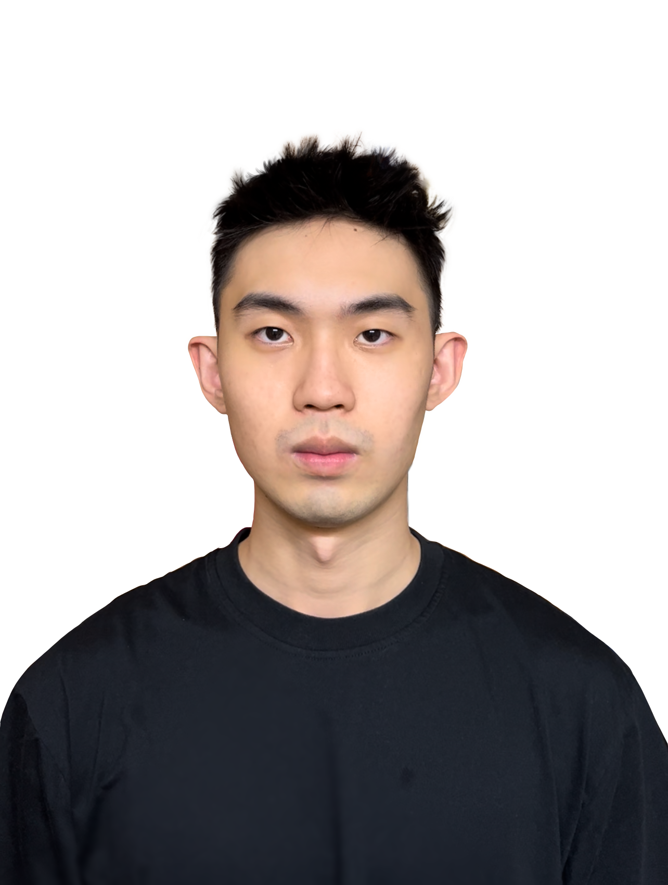
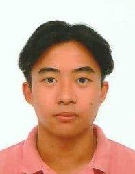

We are a team based in the [School of Computing, National University of Singapore](http://www.comp.nus.edu.sg).

You can reach us at the email `seer[at]comp.nus.edu.sg`

## Project team

### John Doe

[[homepage](http://www.comp.nus.edu.sg/~damithch)]
[[github](https://github.com/johndoe)]
[[portfolio](team/johndoe.md)]

* Role: Project Advisor

### Chia Yun Rong

[[github](https://github.com/chiayunrong)]
[[portfolio](team/chiayunrong.md)]

* Role: Team lead, Testing
* Responsibilities:
    * Overall project coordination.
    * Ensures the testing of the project is done properly and on time.

### Jonathan Yeo

[[homepage](https://github.com/jonyeokj)]
[[github](https://github.com/jonyeokj)]
[[portfolio](team/jonyeokj.md)]

* Role: Documentation, Integration
* Responsibilities:
    - Responsible for the quality of various project documents.
    - In charge of versioning the code, and maintaining the code repository.

### Johnny Doe

[[github](http://github.com/johndoe)] [[portfolio](team/johndoe.md)]

* Role: Developer
* Responsibilities: Data

### Jean Doe

[[github](http://github.com/johndoe)]
[[portfolio](team/johndoe.md)]

* Role: Developer
* Responsibilities: Dev Ops + Threading

### Jacob Cuison

[[github](http://github.com/jacobcuison)]
[[portfolio](team/johndoe.md)]

* Role: Code quality
* Responsibilities: Looks after code quality, ensures adherence to coding standards, etc.
