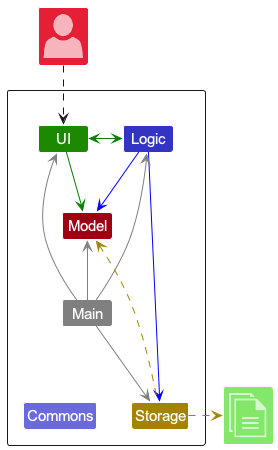
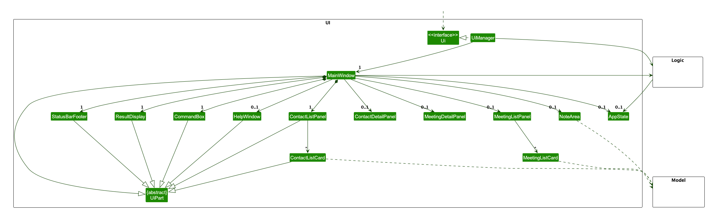
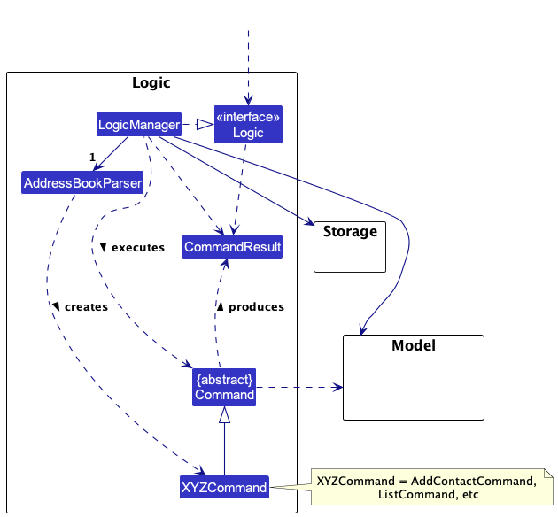
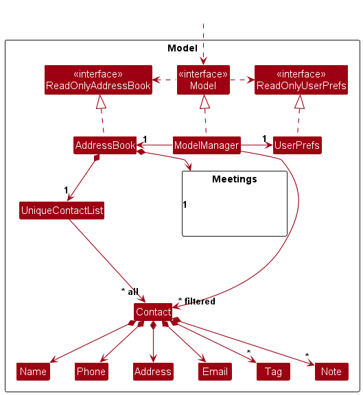
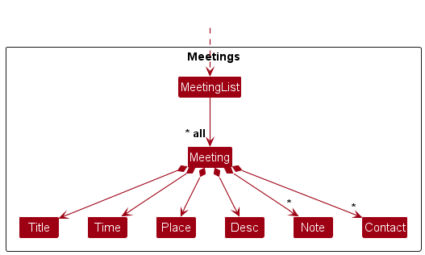
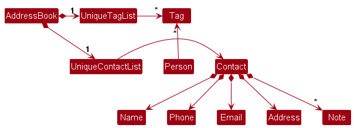
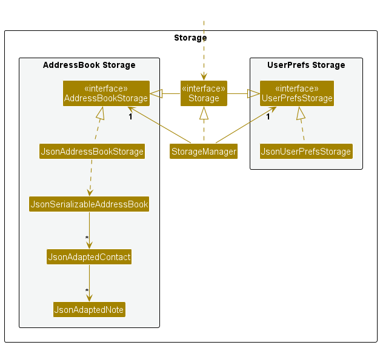

* Table of Contents
  {:toc}

--------------------------------------------------------------------------------------------------------------------

## **Acknowledgements**

* {list here sources of all reused/adapted ideas, code, documentation, and third-party libraries -- include links to the
  original source as well}

--------------------------------------------------------------------------------------------------------------------

## **Setting up, getting started**

Refer to the guide [_Setting up and getting started_](SettingUp.md).

--------------------------------------------------------------------------------------------------------------------

## **Design**

:bulb: **Tip:** The `.puml` files used to create diagrams in this document `docs/diagrams` folder. Refer to the [_
PlantUML Tutorial_ at se-edu/guides](https://se-education.org/guides/tutorials/plantUml.html) to learn how to create and
edit diagrams.

### Architecture

The ***Architecture Diagram*** given above explains the high-level design of the App.

Given below is a quick overview of main components and how they interact with each other.

**Main components of the architecture**

**`Main`** (consisting of
classes [`Main`](https://github.com/se-edu/addressbook-level3/tree/master/src/main/java/seedu/address/Main.java)
and [`MainApp`](https://github.com/se-edu/addressbook-level3/tree/master/src/main/java/seedu/address/MainApp.java)) is
in charge of the app launch and shut down.

* At app launch, it initializes the other components in the correct sequence, and connects them up with each other.
* At shut down, it shuts down the other components and invokes cleanup methods where necessary.

The bulk of the app's work is done by the following four components:

* [**`UI`**](#ui-component): The UI of the App.
* [**`Logic`**](#logic-component): The command executor.
* [**`Model`**](#model-component): Holds the data of the App in memory.
* [**`Storage`**](#storage-component): Reads data from, and writes data to, the hard disk.

[**`Commons`**](#common-classes) represents a collection of classes used by multiple other components.

**How the architecture components interact with each other**

The *Sequence Diagram* below shows how the components interact with each other for the scenario where the user issues
the command `delete 1`.

Each of the four main components (also shown in the diagram above),

* defines its *API* in an `interface` with the same name as the Component.
* implements its functionality using a concrete `{Component Name}Manager` class (which follows the corresponding
  API `interface` mentioned in the previous point.

For example, the `Logic` component defines its API in the `Logic.java` interface and implements its functionality using
the `LogicManager.java` class which follows the `Logic` interface. Other components interact with a given component
through its interface rather than the concrete class (reason: to prevent outside component's being coupled to the
implementation of a component), as illustrated in the (partial) class diagram below.

The sections below give more details of each component.

### UI component

The **API** of this component is specified
in [`Ui.java`](https://github.com/se-edu/addressbook-level3/tree/master/src/main/java/seedu/address/ui/Ui.java)

The UI consists of a `MainWindow` that is made up of parts e.g.`CommandBox`, `ResultDisplay`, `ContactListPanel`
, `StatusBarFooter` etc. All these, including the `MainWindow`, inherit from the abstract `UiPart` class which captures
the commonalities between classes that represent parts of the visible GUI.

The `UI` component uses the JavaFx UI framework. The layout of these UI parts are defined in matching `.fxml` files that
are in the `src/main/resources/view` folder. For example, the layout of
the [`MainWindow`](https://github.com/se-edu/addressbook-level3/tree/master/src/main/java/seedu/address/ui/MainWindow.java)
is specified
in [`MainWindow.fxml`](https://github.com/se-edu/addressbook-level3/tree/master/src/main/resources/view/MainWindow.fxml)

The `UI` component,

* executes user commands using the `Logic` component.
* listens for changes to `Model` data so that the UI can be updated with the modified data.
* keeps a reference to the `Logic` component, because the `UI` relies on the `Logic` to execute commands.
* depends on some classes in the `Model` component, as it displays `Contact` object residing in the `Model`.

### Logic component

**
API** : [`Logic.java`](https://github.com/se-edu/addressbook-level3/tree/master/src/main/java/seedu/address/logic/Logic.java)

Here's a (partial) class diagram of the `Logic` component:

The sequence diagram below illustrates the interactions within the `Logic` component, taking `execute("delete 1")` API
call as an example.

:information_source: **Note:** The lifeline for `DeleteCommandParser` should end at the destroy marker (X) but due to a limitation of PlantUML, the lifeline reaches the end of diagram.

How the `Logic` component works:

1. When `Logic` is called upon to execute a command, it is passed to an `AddressBookParser` object which in turn creates
   a parser that matches the command (e.g., `DeleteCommandParser`) and uses it to parse the command.
1. This results in a `Command` object (more precisely, an object of one of its subclasses e.g., `DeleteCommand`) which
   is executed by the `LogicManager`.
1. The command can communicate with the `Model` when it is executed (e.g. to delete a contact).
1. The result of the command execution is encapsulated as a `CommandResult` object which is returned back from `Logic`.

Here are the other classes in `Logic` (omitted from the class diagram above) that are used for parsing a user command:

How the parsing works:

* When called upon to parse a user command, the `AddressBookParser` class creates an `XYZCommandParser` (`XYZ` is a
  placeholder for the specific command name e.g., `AddCommandParser`) which uses the other classes shown above to parse
  the user command and create a `XYZCommand` object (e.g., `AddCommand`) which the `AddressBookParser` returns back as
  a `Command` object.
* All `XYZCommandParser` classes (e.g., `AddCommandParser`, `DeleteCommandParser`, ...) inherit from the `Parser`
  interface so that they can be treated similarly where possible e.g, during testing.

### Model component

**
API** : [`Model.java`](https://github.com/se-edu/addressbook-level3/tree/master/src/main/java/seedu/address/model/Model.java)

The `Model` component,

* stores the address book data i.e., all `Contact` objects (which are contained in a `UniqueContactList` object).
* stores the currently 'selected' `Contact` objects (e.g., results of a search query) as a separate _filtered_ list
  which is exposed to outsiders as an unmodifiable `ObservableList<Contact>` that can be 'observed' e.g. the UI can be
  bound to this list so that the UI automatically updates when the data in the list change.
* stores a `UserPref` object that represents the user’s preferences. This is exposed to the outside as
  a `ReadOnlyUserPref` objects.
* does not depend on any of the other three components (as the `Model` represents data entities of the domain, they
  should make sense on their own without depending on other components)

* The AddressBook data contains all the `Meeting` objects contained in a `MeetingList` object.
* stores the currently 'selected' `Meeting` objects as a separate _filtered_ list
  which is exposed to outsiders as an unmodifiable `ObservableList<Meeting>` that can be 'observed' e.g. the UI can be
  bound to this list so that the UI automatically updates when the data in the list change.
* The `Meeting` object can store an infinite number of `Contact` object representing participants to the meeting.
* Likewise the `Contact` Object can be removed from the `Meeting` Object.
* The `Contact` object is identified by its name when adding it to `Meeting` object.

:information_source: **Note:** An alternative (arguably, a more OOP) model is given below. It has a `Tag` list in the `AddressBook`, which `Contact` references. This allows `AddressBook` to only require one `Tag` object per unique tag, instead of each `Contact` needing their own `Tag` objects. 

### Storage component

**
API** : [`Storage.java`](https://github.com/se-edu/addressbook-level3/tree/master/src/main/java/seedu/address/storage/Storage.java)

The `Storage` component,

* can save both address book data and user preference data in JSON format, and read them back into corresponding
  objects.
* inherits from both `AddressBookStorage` and `UserPrefStorage`, which means it can be treated as either one (if only
  the functionality of only one is needed).
* depends on some classes in the `Model` component (because the `Storage` component's job is to save/retrieve objects
  that belong to the `Model`)

### Common classes

Classes used by multiple components are in the `seedu.addressbook.commons` package.

--------------------------------------------------------------------------------------------------------------------

## **Implementation**

This section describes some noteworthy details on how certain features are implemented.

### \[Proposed\] Undo/redo feature

#### Proposed Implementation

The proposed undo/redo mechanism is facilitated by `VersionedAddressBook`. It extends `AddressBook` with an undo/redo
history, stored internally as an `addressBookStateList` and `currentStatePointer`. Additionally, it implements the
following operations:

* `VersionedAddressBook#commit()` — Saves the current address book state in its history.
* `VersionedAddressBook#undo()` — Restores the previous address book state from its history.
* `VersionedAddressBook#redo()` — Restores a previously undone address book state from its history.

These operations are exposed in the `Model` interface as `Model#commitAddressBook()`, `Model#undoAddressBook()`
and `Model#redoAddressBook()` respectively.

Given below is an example usage scenario and how the undo/redo mechanism behaves at each step.

Step 1. The user launches the application for the first time. The `VersionedAddressBook` will be initialized with the
initial address book state, and the `currentStatePointer` pointing to that single address book state.

Step 2. The user executes `delete 5` command to delete the 5th contact in the address book. The `delete` command
calls `Model#commitAddressBook()`, causing the modified state of the address book after the `delete 5` command executes
to be saved in the `addressBookStateList`, and the `currentStatePointer` is shifted to the newly inserted address book
state.

Step 3. The user executes `add n/David …​` to add a new contact. The `add` command also
calls `Model#commitAddressBook()`, causing another modified address book state to be saved into
the `addressBookStateList`.

:information_source: **Note:** If a command fails its execution, it will not call `Model#commitAddressBook()`, so the address book state will not be saved into the `addressBookStateList`.

Step 4. The user now decides that adding the contact was a mistake, and decides to undo that action by executing
the `undo` command. The `undo` command will call `Model#undoAddressBook()`, which will shift the `currentStatePointer`
once to the left, pointing it to the previous address book state, and restores the address book to that state.

:information_source: **Note:** If the `currentStatePointer` is at index 0, pointing to the initial AddressBook state, then there are no previous AddressBook states to restore. The `undo` command uses `Model#canUndoAddressBook()` to check if this is the case. If so, it will return an error to the user rather
than attempting to perform the undo.

The following sequence diagram shows how the undo operation works:

:information_source: **Note:** The lifeline for `UndoCommand` should end at the destroy marker (X) but due to a limitation of PlantUML, the lifeline reaches the end of diagram.

The `redo` command does the opposite — it calls `Model#redoAddressBook()`, which shifts the `currentStatePointer` once
to the right, pointing to the previously undone state, and restores the address book to that state.

:information_source: **Note:** If the `currentStatePointer` is at index `addressBookStateList.size() - 1`, pointing to the latest address book state, then there are no undone AddressBook states to restore. The `redo` command uses `Model#canRedoAddressBook()` to check if this is the case. If so, it will return an error to the user rather than attempting to perform the redo.

Step 5. The user then decides to execute the command `list`. Commands that do not modify the address book, such
as `list`, will usually not call `Model#commitAddressBook()`, `Model#undoAddressBook()` or `Model#redoAddressBook()`.
Thus, the `addressBookStateList` remains unchanged.

Step 6. The user executes `clear`, which calls `Model#commitAddressBook()`. Since the `currentStatePointer` is not
pointing at the end of the `addressBookStateList`, all address book states after the `currentStatePointer` will be
purged. Reason: It no longer makes sense to redo the `add n/David …​` command. This is the behavior that most modern
desktop applications follow.

The following activity diagram summarizes what happens when a user executes a new command:

#### Design considerations:

**Aspect: How undo & redo executes:**

* **Alternative 1 (current choice):** Saves the entire address book.
    * Pros: Easy to implement.
    * Cons: May have performance issues in terms of memory usage.

* **Alternative 2:** Individual command knows how to undo/redo by
  itself.
    * Pros: Will use less memory (e.g. for `delete`, just save the contact being deleted).
    * Cons: We must ensure that the implementation of each individual command are correct.

_{more aspects and alternatives to be added}_

### \[Proposed\] Command History and Auto-Complete Feature

#### Proposed Implementation

The proposed command history and auto-complete mechanism is facilitated by `CommandHistory`. It extends `NoteNote` with a command history, stored internally as `commandList`. Additionally, it implements the following operations:

* `CommandHistory#addCommand(String command)` - Adds the executed command to the command history.
* `CommandHistory#getFilteredCommands(String input)` - Retrieves a list of commands from the command history that starts with the given input.

These operations are exposed in the `Model` interface as `Model#addCommandHistory(String command)` and `Model#getFilteredCommandHistory(String input)` respectively.

When the user presses the up or down arrow key, the `UI` will call `Model#getFilteredCommandHistory(String input)`, where `input` is the current text in the command input box. The retrieved list of commands will be displayed in the command input box, allowing the user to cycle through the commands by continuing to press the up or down arrow key.

Given below is an example usage scenario and how the command history and auto-complete mechanism behaves at each step.

Step 1. The user launches the application for the first time. The `CommandHistory` will be initialized as an empty list.

Step 2. The user executes the command `add meeting -title Project Meeting -time 01/01/2023 12:00 -place Zoom`. The command calls `Model#addCommandHistory(String command)`, causing the executed command to be saved in the `commandList`.

Step 3. The user then executes the command `add meeting -title Tutorial -time 01/01/2023 13:00 -place Discord`. This command is also saved in the `commandList`.

Step 4. The user starts to type the command `add mee` and then presses the up or down arrow key. The `UI` will call `Model#getFilteredCommandHistory(String input)`, which retrieves the list of commands starting with `add mee` from the `commandList`. In this case, it will retrieve the two previous commands.

Step 5. The user can then cycle through the two commands by pressing the up or down arrow key. The commands will be displayed in the command input box in reverse chronological order.

#### Design Considerations:

**Aspect: How the command history and auto-complete feature is implemented:**

* **Alternative 1: Store Commands as Strings**
    * Implementation: Save each command as a string in a list. When the user presses the up or down arrow key, retrieve the commands that start with the current input.
    * Pros: Simple to implement; easy to retrieve commands.
    * Cons: May include unnecessary information if the command has multiple parameters.

* **Alternative 2: Store Commands as Objects**
    * Implementation: Save each command as an object that includes the command type and its parameters. Implement a method to convert the command object to a string for display. When the user presses the up or down arrow key, retrieve the command objects that match the current input and convert them to strings for display.
    * Pros: Allows for more flexible retrieval and display of commands; can easily extend functionality in the future.
    * Cons: More complex implementation; requires additional processing to convert command objects to strings for display.

### [Implemented] Mode feature

#### Context

At the time when this feature was implemented, the commands within the application were split into 3 broad categories: Commands for contacts, commands for meetings, and general commands.

However, users had to specify each command in entirety without regard for which category the command belonged to. For example when adding a contact to a meeting, the user had to type `add contact to meeting -name ContactName -title MeetingName`.

This format was too lengthy and it seemed highly likely that when a user is interacting with a specific category of commands, they would interact with it more often than the other categories. For example when a user adds a meeting, it more likely that the user follows up with adding contacts or notes to the meeting as compared to other functions of the application.

To improve upon this, a mode feature was implemented so that users can be either in the `contact mode` or `meeting mode` and when a command is run it will automatically be translated into the respective contact or meeting command. So instead of typing `add contact to meeting`, the user could instead type `add contact` while running in the `meeting mode`.

### Implementation

Firstly, in order to keep track of the current mode the application is running in, the Model interface and the ModelManager implementation had to be modified to keep track of what is now known as ModeType, which is an Enum and as of now can only be `CONTACTS` or `MEETINGS`. The general commands such as exit, help and mode itself does not need a ModeType because such commands can be run while in any ModeType. Additionally, the default ModeType when initializing a ModelManager is `CONTACTS` for no particular reason.

Secondly, the Mode command itself is implemented where upon executing the command, the model will update its `FilteredContactList` or `FilteredMeetingList` to show the user the entire contact or meeting list respectively.

Thirdly, all affected commands had to have their formats changed to suit the new style of running under a certain context.

Lastly, the AddressBookParser had to be modified to accomodate the new modes and command formats.

### Design considerations:

Alternative 1 (current choice): Implement the mode command as a standalone without arguments
* Pros: Easy to implement. User can easily toggle between `CONTACTS` and `MEETINGS` ModeType.
* Cons: Less extensible by developers if in the future there are new ModeTypes.

Alternative 2: Implement the mode command with arguments e.g `mode -type CONTACTS`
* Pros: Easily extensible by developers, can just add a new enum for a new ModeType.
* Cons: More troublesome to implement. Harder to use for the users.

### [Proposed] Note Feature

#### Context

Note-taking is the fundamental feature behind our app. It is critical for our users to be able to efficiently record
notes for contacts and meetings.

The full implementation of the feature will include creating, reading, and deleting notes. A possible extension is
giving users the ability to edit previous notes, but that is outside the scope of our project for now.

### Implementation (Add Notes)

A new `Note` class is created, which stores the contents of the note as a string. The `Contact`/`Meeting` model is then updated
to include a new `notes` attribute of type `ArrayList<Note>`.

To distinguish between adding notes to contacts and meetings, 2 separate Command classes are created, namely 
`AddNoteCommand` (for contacts) and `AddMeetingNoteCommand` (for meetings). These classes will then call 
their respective parser classes, to get the arguments passed in by the user. The arguments include the
index of the target contact/meeting and the note itself.

When the respective commands are executed, NoteNote will get the indexed contact/meeting object from
the Model's `FilteredContactList`/`FilteredMeetingList`. Internally, the model will duplicate the existing list of notes
and append the additional note.

Then, a new `Contact`/`Meeting` will be created with identical attributes as the original, with the exception of the
updated `notes` list. The model is then updated with this new `Contact`/`Meeting`, and the filtered list is
updated as well.

### Implementation (Delete Notes)

Once again, there are separate commands for deleting notes from contacts and from meetings. The relationship between the Command
and respective Parser classes is similar to the one described for adding Notes.

In terms of execution, a user will pass the `noteID` of the Note to be deleted as an argument. The `noteID` is the index of the
note, which starts from 1 for each `Contact`/`Meeting`. 

The `Contact`/`Meeting` model will then be updated with the new ArrayList of Notes. AppState is updated as well to ensure
the GUI is refreshed.

### Design Considerations

* **Alternative 1: store `notes` attribute in `Contact` model as `Set<Note>`**
  * Pros: Simpler to implement (similar to `Tag` implementation).
  * Cons: Notes will appear in an arbitrary order, rather than chronologically.

### \[Proposed\] Data archiving

_{Explain here how the data archiving feature will be implemented}_

--------------------------------------------------------------------------------------------------------------------

## **Documentation, logging, testing, configuration, dev-ops**

* [Documentation guide](Documentation.md)
* [Testing guide](Testing.md)
* [Logging guide](Logging.md)
* [Configuration guide](Configuration.md)
* [DevOps guide](DevOps.md)

--------------------------------------------------------------------------------------------------------------------

## **Appendix: Requirements**

### Product scope

**Target user profile**:

* has a need to manage a significant number of contacts and meetings
* prefer desktop apps over other types
* can type fast
* prefers typing to mouse interactions
* is reasonably comfortable using CLI apps

**Value proposition**:

* Allow users to manage their meeting minutes based on their contacts

* manage contacts faster than a typical mouse/GUI driven app

### User stories

Priorities: High (must have) - `* * *`, Medium (nice to have) - `* *`, Low (unlikely to have) - `*`

| Priority | As a …​          | I can …​                                                      | So that I can…​                                              |
|----------|------------------|---------------------------------------------------------------|--------------------------------------------------------------|
| `* * *`  | user             | create meeting cards                                          | keep track of meeting details                                |
| `* * *`  | user             | view my list of meetings                                      | see my upcoming meetings                                     |
| `* * *`  | user             | edit my meeting cards                                         | make changes to the meeting                                  |
| `* * *`  | user             | take notes about meetings                                     | remember key points of discussion                            |
| `* * *`  | user             | delete a meeting                                              | remove unwanted meeting cards                                |
| `* * *`  | user             | create contact cards                                          | keep track of a contact's details                            |
| `* * *`  | user             | view my list of contacts                                      | keep track of the people I know                              |
| `* * *`  | user             | edit my contact cards                                         | make changes to a contact's details                          |
| `* * *`  | user             | delete contacts                                               | manage my contacts                                           |
| `* * *`  | user             | create notes for contacts                                     | keep track of additional information for my contacts         |
| `* *`    | user             | tag contacts                                                  | filter my contacts based on subjects or courses              |
| `* *`    | user             | attach a photo to a contact                                   | visually identify and remember my classmates                 |
| `* *`    | user             | color-code my contacts                                        | for a visual representation of my network                    |
| `* *`    | new user         | see a list of commands                                        | learn more about how to use the application                  |
| `* *`    | new user         | have a default timezone                                       | dates are accurately recorded in my timezone                 |
| `* *`    | user             | pin important contacts                                        | find my important contacts quickly                           |
| `* *`    | user             | see a list of upcoming meetings and tasks for the day         | know how to plan my day                                      |
| `* *`    | user             | add hyperlinks or references to online resources within notes | have the convenience of one-click access to online materials |
| `* *`    | forgetful user   | set a reminder for an upcoming meeting                        | I won't miss the meeting                                     |
| `* *`    | user             | create follow-up action items within a meeting's notes        | keep track of important tasks for a meeting                  |
| `* *`    | user             | set deadlines for action items                                | ensure action items are completed in a timely manner         |
| `* *`    | user             | set reminders for action items                                | I won't forget the action items                              |
| `* *`    | user             | view the edit history of my notes                             | backtrack on my note-taking changes                          |
| `*`      | experienced user | encrypt my contact and meeting cards                          | ensure the privacy and security of my data                   |
| `*`      | experienced user | backup my contact and meeting cards                           | ensure redundancy for my data                                |
| `*`      | user             | filter contacts based on collaboration frequency              | identify frequent collaborators                              |
| `*`      | forgetful user   | see a list of the most recent actions I have performed        | remember what I have added or deleted                        |

### Use cases

(For all use cases below, the **System** is the `NoteNote` and the **Actor** is the `user`, unless specified otherwise)

**UC01 - Create a meeting**

**MSS**

1. User requests to create a meeting specifying meeting name, notes, and contact(s).
2. NoteNote creates the meeting card.
3. NoteNote displays the newly created meeting card.

    Use case ends.

**Extensions**

* 1a. The request is in an improper format.

    * 1a1. NoteNote shows an error message.
    * 1a2. User request to create a meeting in the correct format.

      Use case resumes at step 2.

* 1b. The specified contact(s) do/does not exist in NoteNote.

    * 1b1. NoteNote shows an error message.

        Use case ends.

**UC02 - Delete a meeting**

**MSS**

1. User requests to delete a meeting specifying meeting index.
2. NoteNote validates the provided index, retrieves the corresponding meeting, and deletes it.
3. NoteNote confirms the deletion and updates the display.

    Use case ends.

**Extensions**

* 1a. The request is in an improper format.

    * <ins>(Refer to UC01, 1a)</ins>

* 1b. The specified meeting index is invalid or does not exist in NoteNote.

    * <ins>(Refer to UC01, 1b)</ins>

**UC03 - Edit a meeting**

**MSS**

1. User requests to edit a meeting specifying meeting index and changes to be made (e.g., meeting title, time, etc.).
2. NoteNote validates the provided index, retrieves the corresponding meeting, and applies the requested changes.
3. NoteNote saves the changes and displays the updated meeting card.

    Use case ends.

**Extensions**

* 1a. The request is in an improper format.

    * <ins>(Refer to UC01, 1a)</ins>

* 1b. The specified meeting index is invalid or does not exist in NoteNote.

    * <ins>(Refer to UC01, 1b)</ins>

**UC04 - Take notes about meetings**

**MSS**

1. User selects a meeting and updates it with notes/comments/remarks.
2. The meeting is updated with the given notes/comments/remarks.
3. NoteNote displays the meeting with the updated notes/comments/remarks.

    Use case ends.

**Extensions**

* 1a. The specified meeting(s) do/does not exist in NoteNote.

    * 1a1. NoteNote shows an error message.
    * 1a2. User acknowledges the error message.

      Use case ends.

**UC05 - Add additional contacts to a meeting**

**MSS**

1. User <ins>creates a meeting (UC01) .</ins>
2. User requests to add contacts to the meeting.
3. NoteNote displays the details of the meeting with the newly added contact.

    Use case ends.

**Extensions**

* 2a. The request is in an improper format.

    * 2a1. NoteNote shows an error message.
    * 2a2. User request to add contacts to the meeting in the correct format.

      Use case resumes at step 3.

* 2b. The specified contact(s)/meeting do/does not exist in NoteNote.

    * 2b1. NoteNote shows an error message.
    * 2b2. User requests to add contacts with existing contact(s)/meeting.

      Use case resumes at step 3.

*{More to be added}*

### Non-Functional Requirements

1. Should work on any _mainstream OS_ as long as it has Java `11` or above installed.
2. Should be able to hold up to 1000 contacts without a noticeable sluggishness in performance for typical usage.
3. A user with above average typing speed for regular English text (i.e. not code, not system admin commands) should be able to accomplish most of the tasks faster using commands than using the mouse.

*{More to be added}*

### Glossary

* **Mainstream OS**: Windows, Linux, Unix, OS-X

--------------------------------------------------------------------------------------------------------------------

## **Appendix: Instructions for manual testing**

Given below are instructions to test the app manually.

:information_source: **Note:** These instructions only provide a starting point for testers to work on;
testers are expected to do more *exploratory* testing.

### Launch and shutdown

1. Initial launch

    1. Download the jar file and copy into an empty folder

    1. Double-click the jar file Expected: Shows the GUI with a set of sample contacts. The window size may not be
       optimum.

1. Saving window preferences

    1. Resize the window to an optimum size. Move the window to a different location. Close the window.

    1. Re-launch the app by double-clicking the jar file. 
       Expected: The most recent window size and location is retained.

1. _{ more test cases …​ }_

### Deleting a contact

1. Deleting a contact while all contacts are being shown

    1. Prerequisites: List all contacts using the `list` command. Multiple contacts in the list.

    1. Test case: `delete -id 1` 
       Expected: First contact is deleted from the list. Details of the deleted contact shown in the status message.
       Timestamp in the status bar is updated.

    1. Test case: `delete -id 0` 
       Expected: No contact is deleted. Error details shown in the status message. Status bar remains the same.

    1. Other incorrect delete commands to try: `delete`, `delete x`, `...` (where x is larger than the list size) 
       Expected: Similar to previous.

1. _{ more test cases …​ }_

### Saving data

1. Dealing with missing/corrupted data files

    1. _{explain how to simulate a missing/corrupted file, and the expected behavior}_

1. _{ more test cases …​ }_
