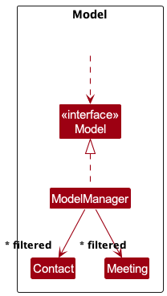
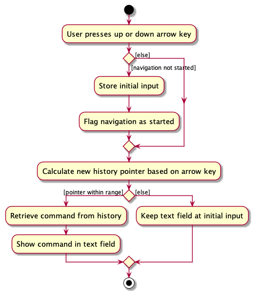
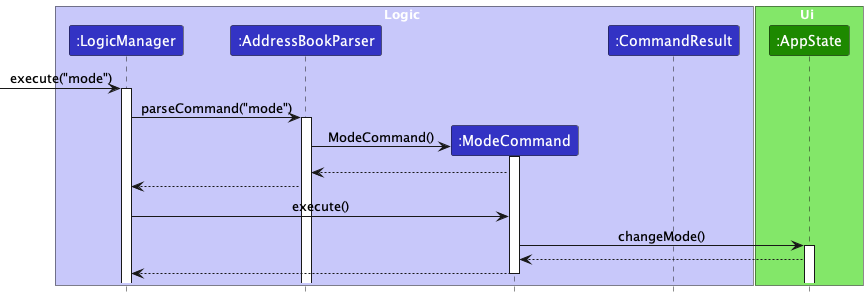
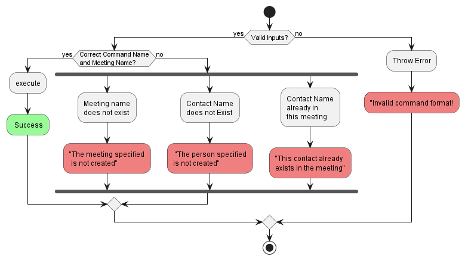
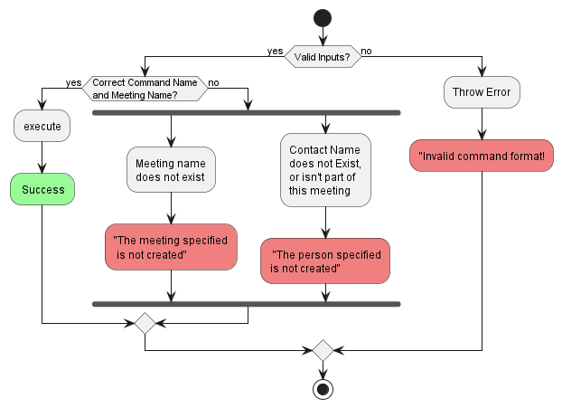
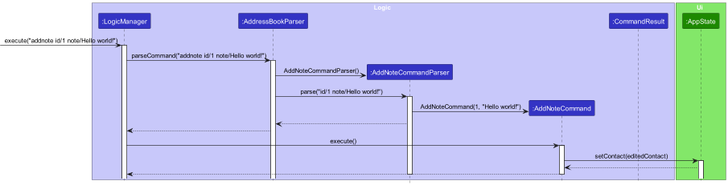

## **Acknowledgements**

* The original codebase for this brownfield project is derived from [AddressBook Level-3](https://se-education.org/addressbook-level3/).
* The following libraries were used: [JavaFX](https://openjfx.io/), [Jackson](https://github.com/FasterXML/jackson), [JUnit5](https://github.com/junit-team/junit5).

--------------------------------------------------------------------------------------------------------------------

## **Setting up, getting started**

Refer to the guide [_Setting up and getting started_](SettingUp.md).

--------------------------------------------------------------------------------------------------------------------

## Table of Contents

1. [Design](#design)
    - [Architecture](#architecture)
    - [UI Component](#ui-component)
    - [Logic Component](#logic-component)
    - [Model Component](#model-component)
    - [Storage Component](#storage-component)
    - [Common Classes](#common-classes)
2. [Implementation](#implementation)
    - [Command History and Auto-Complete Feature](#command-history-and-auto-complete-feature)
    - [Mode Feature](#mode-feature)
    - [Contain Contacts in Meeting Feature](#contain-contacts-in-meeting-feature)
    - [Note Feature](#note-feature)
    - [Proposed-Undo/Redo Feature](#proposed-undoredo-feature)
3. [Documentation links](#documentation-logging-testing-configuration-dev-ops)
4. [Appendix: Requirements](#appendix-requirements)
    - [Product Scope](#product-scope)
    - [User Stories](#user-stories)
    - [Use Cases](#use-cases)
    - [Non-Functional Requirements](#non-functional-requirements)
    - [Glossary](#glossary)
5. [Appendix: Instructions For Manual Testing](#appendix-instructions-for-manual-testing)
    - [Launch and Shutdown](#launch-and-shutdown)
    - [Clear Address Book](#clear-address-book)
    - [Add a Contact](#add-a-contact)
    - [View a Contact](#view-a-contact)
    - [List Contacts](#list-contacts)
    - [Edit a Contact](#edit-a-contact)
    - [Deleting a Contact](#deleting-a-contact)
    - [Add a Meeting](#add-a-meeting)
    - [View a Meeting](#view-a-meeting)
    - [List Meetings](#list-meetings)
    - [Edit a Meeting](#edit-a-meeting)
    - [Delete a Meeting](#delete-a-meeting)
    - [Add contact to Meeting](#add-contact-to-meeting)
    - [Delete Contact From a Meeting Through Meetings](#delete-contact-from-a-meeting-through-meetings)
    - [Delete contact from a meeting through deleting contact](#delete-contact-from-a-meeting-through-deleting-contact)
    - [Add Notes to a Meeting](#add-notes-to-a-meeting)
    - [Delete Notes from a Meeting](#delete-notes-from-a-meeting)
    - [Saving Data](#saving-data)
6. [Planned Enhancements](#planned-enhancements)

---

## **Design**

:bulb: **Tip:** The `.puml` files used to create diagrams in this document `docs/diagrams` folder. Refer to the [_PlantUML Tutorial_ at se-edu/guides](https://se-education.org/guides/tutorials/plantUml.html) to learn how to create and edit diagrams.

### Architecture

The ***Architecture Diagram*** given above explains the high-level design of the App.

Given below is a quick overview of main components and how they interact with each other.

**Main components of the architecture**

**`Main`** (consisting of classes [`Main`](https://github.com/AY2324S1-CS2103-W14-2/tp/blob/master/src/main/java/seedu/address/Main.java)
and [`MainApp`](https://github.com/AY2324S1-CS2103-W14-2/tp/blob/master/src/main/java/seedu/address/MainApp.java)) is in charge of the app launch and shut down.

* At app launch, it initializes the other components in the correct sequence, and connects them up with each other.
* At shut down, it shuts down the other components and invokes cleanup methods where necessary.

The bulk of the app's work is done by the following four components:

* [**`UI`**](#ui-component): The UI of the App.
* [**`Logic`**](#logic-component): The command executor.
* [**`Model`**](#model-component): Holds the data of the App in memory.
* [**`Storage`**](#storage-component): Reads data from, and writes data to, the hard disk.

[**`Commons`**](#common-classes) represents a collection of classes used by multiple other components.

**How the architecture components interact with each other**

The *Sequence Diagram* below shows how the components interact with each other for the scenario where the user issues the command `delete 1`.

Each of the four main components (also shown in the diagram above),

* defines its *API* in an `interface` with the same name as the Component.
* implements its functionality using a concrete `{Component Name}Manager` class which follows the corresponding API `interface` mentioned in the previous point.

For example, the `Logic` component defines its API in the `Logic.java` interface and implements its functionality using the `LogicManager.java` class which follows the `Logic` interface. Other components interact with a given component through its interface rather than the concrete class (reason: to prevent outside component's being coupled to the implementation of a component), as illustrated in the (partial) class diagram below.

The sections below give more details of each component.

[Back to Top](#table-of-contents)

### UI component

The **API** of this component is specified in [`Ui.java`](https://github.com/AY2324S1-CS2103-W14-2/tp/blob/master/src/main/java/seedu/address/ui/Ui.java)

The UI consists of a `MainWindow` that is made up of parts e.g.`CommandBox`, `ResultDisplay`, `ContactListPanel`, `MeetingListPanel`, `StatusBarFooter` etc. All these, including the `MainWindow`, inherit from the abstract `UiPart` class which captures the commonalities between classes that represent parts of the visible GUI.

The UI also has an `AppState` class, which maintains the dynamic aspects of the UI, such as which mode the application is in, which panels are displayed, and the contacts or meetings to be displayed. This allows the UI to remain responsive and accurate to user interactions and command results.

The `AppState` class is a singleton class, ensuring that the UI components are synchronized with the current state of the application. It is updated (if necessary) when commands are executed in the `Logic` class, and these updates are checked in the `MainWindow` class to display on the visible GUI.

The `UI` component uses the JavaFx UI framework. The layout of these UI parts are defined in matching `.fxml` files that are in the `src/main/resources/view` folder. For example, the layout of the [`MainWindow`](https://github.com/se-edu/addressbook-level3/tree/master/src/main/java/seedu/address/ui/MainWindow.java)
is specified in [`MainWindow.fxml`](https://github.com/AY2324S1-CS2103-W14-2/tp/blob/master/src/main/resources/view/MainWindow.fxml)

The `UI` component,

* executes user commands using the `Logic` component.
* keeps a reference to the `Logic` component, because the `UI` relies on the `Logic` to execute commands.
* listens for changes within the `AppState` singleton class. This is crucial for updating the application's state based on changes triggered by the `Logic` component's operations.
* relies on the Model component for displaying `Contact` and `Meeting` objects. The Model is responsible for managing the in-memory representation of the addressbook data.

[Back to Top](#table-of-contents)

### Logic component

**API** : [`Logic.java`](https://github.com/AY2324S1-CS2103-W14-2/tp/blob/master/src/main/java/seedu/address/logic/Logic.java)

Here's a (partial) class diagram of the `Logic` component:

The sequence diagram below illustrates the interactions within the `Logic` component, taking `execute("delete 1")` API call as an example.

:information_source: **Note:** The lifeline for `DeleteCommandParser` should end at the destroy marker (X) but due to a limitation of PlantUML, the lifeline reaches the end of diagram.

How the `Logic` component works:

1. When `Logic` is called upon to execute a command, it is passed to an `AddressBookParser` object which in turn creates a parser that matches the command (e.g., `DeleteCommandParser`) and uses it to parse the command.
1. This results in a `Command` object (more precisely, an object of one of its subclasses e.g., `DeleteCommand`) which is executed by the `LogicManager`.
1. The command can communicate with the `Model` when it is executed (e.g. to delete a contact).
1. The result of the command execution is encapsulated as a `CommandResult` object which is returned back from `Logic`.

Here are the other classes in `Logic` (omitted from the class diagram above) that are used for parsing a user command:

How the parsing works:

* When called upon to parse a user command, the `AddressBookParser` class creates an `XYZCommandParser` (`XYZ` is a placeholder for the specific command name e.g., `AddCommandParser`) which uses the other classes shown above to parse the user command and create a `XYZCommand` object (e.g., `AddCommand`) which the `AddressBookParser` returns back as a `Command` object.
* All `XYZCommandParser` classes (e.g., `AddCommandParser`, `DeleteCommandParser`, ...) inherit from the `Parser`
  interface so that they can be treated similarly where possible e.g, during testing.

[Back to Top](#table-of-contents)

### Model component

**API** : [`Model.java`](https://github.com/AY2324S1-CS2103-W14-2/tp/blob/master/src/main/java/seedu/address/model/Model.java)

The `Model` component,

* stores the address book data i.e., all `Contact` and `Meeting` objects (which are contained in a `UniqueContactList` and `UniqueMeetingList` object respectively).
* stores a `UserPref` object that represents the user’s preferences. This is exposed to the outside as a `ReadOnlyUserPref` objects.
* does not depend on any of the other three components (as the `Model` represents data entities of the domain, they should make sense on their own without depending on other components)

* stores the currently 'selected' `Contact` or `Meeting` objects (e.g., results of a search query) as a separate _filtered_ list which is exposed to outsiders as an unmodifiable `ObservableList<Contact>` or `ObservableList<Meeting>` respectively that can be 'observed' e.g. the UI can be bound to this list so that the UI can fetch this data into its `AppState` class when necessary, and reflect these changes on the GUI.

[Back to Top](#table-of-contents)

### Storage component

**API** : [`Storage.java`](https://github.com/AY2324S1-CS2103-W14-2/tp/blob/master/src/main/java/seedu/address/ui/storage/Storage.java)

The `Storage` component,

* can save both address book data and user preference data in JSON format, and read them back into corresponding objects.
* inherits from both `AddressBookStorage` and `UserPrefStorage`, which means it can be treated as either one (if only the functionality of only one is needed).
* depends on some classes in the `Model` component (because the `Storage` component's job is to save/retrieve objects that belong to the `Model`)

[Back to Top](#table-of-contents)

### Common classes

Classes used by multiple components are in the `seedu.addressbook.commons` package.

--------------------------------------------------------------------------------------------------------------------

## **Implementation**

This section describes some noteworthy details on how certain features are implemented.

### Command History and Auto-Complete Feature

#### Context

The command history and auto-complete feature aims to enhance user experience by allowing users to quickly access previously executed commands and complete partial command inputs. This feature is especially useful for users who perform a series of similar commands consecutively, as it saves time and reduces the likelihood of input errors.

By utilizing this command history and auto-complete feature, users can improve their efficiency when interacting with the application, significantly speeding up the workflow for repetitive command entry.

#### Implementation

The `CommandBox` component is at the heart of this feature. It maintains a list of the user's command history and provides functionalities to navigate through this history using keyboard inputs.

1. **Storing Command History:** As users execute commands, these are stored in a `commandHistory` list in the `CommandBox`. Duplicate entries are prevented by removing the previous instance of the command before re-adding it, ensuring the most recent use is at the end of the list.

2. **Navigation Through Command History:** The user can navigate through the command history by pressing the up or down arrow keys. The `navigateCommandHistory(int offset)` method updates the `currentHistoryPointer` and sets the text of the `commandTextField` to the command at the new history pointer index.

3. **Auto-Completion Mechanism:** The auto-complete mechanism is triggered when the user starts typing a command and presses the up or down arrow key. The `getFilteredHistory()` method retrieves a list of commands that start with the current input, allowing the user to cycle through relevant commands only.

The following activity diagram represents the sequence of actions that occur when the user navigates through the command history in the `CommandBox`:

#### Design Considerations:

Alternative 1 (current choice): Store Commands as Strings and use pointers

- **Pros:** Simple implementation with low overhead. Efficient in terms of memory and processing as it works with strings directly.
- **Cons:** Limited functionality for more complex use cases. Does not allow for structured analysis or manipulation of command components.

Alternative 2: Store Commands as Objects

- **Pros:** Offers greater flexibility for future enhancements, such as argument analysis and command editing. Facilitates complex command manipulations and extensions.
- **Cons:** More complex implementation. Requires additional memory and processing to manage command objects instead of simple strings. Also, not as intuitive since you do not saved failed commands.

[Back to Top](#table-of-contents)

### Mode feature

#### Context

At the time when this feature was implemented, the commands within the application were split into 3 broad categories: Commands for contacts, commands for meetings, and general commands.

However, users had to specify each command in entirety without regard for which category the command belonged to. For example when adding a contact to a meeting, the user had to type `add contact to meeting n/ContactName m/MeetingName`.

This format was too lengthy and it seemed highly likely that when a user is interacting with a specific category of commands, they would interact with it more often than the other categories. For example when a user adds a meeting, it more likely that the user follows up with adding contacts or notes to the meeting as compared to other functions of the application.

To improve upon this, a mode feature was implemented so that users can be either in the `contact mode` or `meeting mode` and when a command is run it will automatically be translated into the respective contact or meeting command. So instead of typing `add contact to meeting`, the user could instead type `addcontact` while running in the `meeting mode`.

### Implementation

Firstly, in order to keep track of the current mode the application is running in, an AppState singleton class was added to keep track of what is now known as ModeType, an Enum which can only be `CONTACTS` or `MEETINGS`. The general commands such as exit, help and mode itself does not need a ModeType because such commands can be run while in any ModeType. Additionally, the default ModeType when initializing a ModelManager is `CONTACTS` for no particular reason.

Secondly, the Mode command itself is implemented where upon executing the command, the model will update AppState which will in turn update its `FilteredContactList` or `FilteredMeetingList` to show the user the entire contact or meeting list respectively.

Thirdly, all affected commands had to have their formats changed to suit the new style of running under a certain context.

Lastly, the AddressBookParser had to be modified to accomodate the new modes and command formats.

Below is a sequence diagram showing how the running ModeType of the application is changed.

### Design considerations:

Alternative 1 (current choice): Implement the mode command as a standalone without arguments

* Pros: Easy to implement. User can easily toggle between `CONTACTS` and `MEETINGS` ModeType.
* Cons: Less extensible by developers if in the future there are new ModeTypes.

Alternative 2: Implement the mode command with arguments e.g `mode -type CONTACTS`

* Pros: Easily extensible by developers, can just add a new enum for a new ModeType.
* Cons: More troublesome to implement. Harder to use for the users.

[Back to Top](#table-of-contents)

## Contain Contacts in Meeting Feature

### Implementation (Add Contact to Meeting)

With a given MeetingTitle and Contact Name, we first check for whether the contact and meeting exists in addressBook. If either is not found, we throw an error as per the activity diagram.

Next, we register the meeting as a observer to the contact, which will be notified when this contact is deleted from address book, which will then delete the contact from itself.

We then add the contact to the contact list of the meeting.

### Implementation (Delete Contact From Meeting)

With a given MeetingTitle and Contact Name, we first check for whether meeting exists in addressBook and whether the contact resides in the meeting. If either is not found, we throw an error as per the activity diagram.

The contact is then removed from the meeting.

[Back to Top](#table-of-contents)

### Note Feature

#### Context

Note-taking is the fundamental feature behind our app. It is critical for our users to be able to efficiently record notes for contacts and meetings.

The full implementation of the feature will include creating, reading, and deleting notes. A possible extension is giving users the ability to edit previous notes, but that is outside the scope of our project for now.

### Implementation (Add Notes)

A new `Note` class was created, which stores the contents of the note as a string. The `Contact`/`Meeting` model was then updated to include a new `notes` attribute of type `ArrayList<Note>`.

To distinguish between adding notes to contacts and meetings, 2 separate Command classes are created, namely
`AddNoteCommand` (for contacts) and `AddMeetingNoteCommand` (for meetings). For brevity, this documentation is written in the context of Contacts. However, rest assured that the implementation is the same for Meetings.

The `AddNoteCommand` will call its respective parser class, `AddNoteCommandParser`, to get the arguments passed in by the user. The arguments include the index of the target contact using the `id/` prefix, and the note itself with the `note/` prefix.

Before execution, NoteNote will check that the supplied arguments are valid. The conditions of a valid index and note can be found in the User Guide. NoteNote will also check for the presence of duplicate notes, in which case an exception will be thrown.

When the command is executed, NoteNote will get the indexed Contact object from the Model's `FilteredContactList`. Internally, the model will duplicate the existing list of notes and append the additional note.

Then, a new `Contact` object will be created with identical attributes as the original, besides the updated `notes` list. This is object is called `editedContact`, and the model is then updated with this. The AppState is then refreshed to ensure the latest list of notes are being displayed.

Below is a simplified, high-level sequence diagram that illustrates what happens when the command `addnote 1 note/Hello world!` is executed in `CONTACTS` mode, given that there is at least one contact added.

### Implementation (Delete Notes)

Behind the scenes, the implementation of deleting notes is largely similar to that of adding notes. There are separate commands classes and parser classes for deleting notes from contacts and from meetings. Once again, this section zooms in on the context of Contacts, but the implementation details are the same for Meetings.

In terms of execution, a user will pass the index of the note to be deleted as an argument, as well as the index of the Contact.

The current list of notes from the target contact is then retrieved. Using `ArrayList`'s `remove()` method, the target note is then deleted from this list.

Once again, a new `Contact` object is then created, with the same attributes as the original one besides the new list of notes. The model will then be updated with this new `Contact` object. AppState is updated as well to ensure the GUI is refreshed.

### Design Considerations

* Alternative 1: store `notes` attribute in `Contact` model as `Set<Note>`
    * Pros: Simpler to implement (similar to existing `Tag` implementation).
    * Cons: Notes will appear in an arbitrary order, rather than chronologically.

[Back to Top](#table-of-contents)

### \[Proposed\] Undo/redo feature

#### Proposed Implementation

The proposed undo/redo mechanism is facilitated by `VersionedAddressBook`. It extends `AddressBook` with an undo/redo history, stored internally as an `addressBookStateList` and `currentStatePointer`. Additionally, it implements the following operations:

* `VersionedAddressBook#commit()` — Saves the current address book state in its history.
* `VersionedAddressBook#undo()` — Restores the previous address book state from its history.
* `VersionedAddressBook#redo()` — Restores a previously undone address book state from its history.

These operations are exposed in the `Model` interface as `Model#commitAddressBook()`, `Model#undoAddressBook()`
and `Model#redoAddressBook()` respectively.

Given below is an example usage scenario and how the undo/redo mechanism behaves at each step.

Step 1. The user launches the application for the first time. The `VersionedAddressBook` will be initialized with the initial address book state, and the `currentStatePointer` pointing to that single address book state.

Step 2. The user executes `delete 5` command to delete the 5th contact in the address book. The `delete` command calls `Model#commitAddressBook()`, causing the modified state of the address book after the `delete 5` command executes to be saved in the `addressBookStateList`, and the `currentStatePointer` is shifted to the newly inserted address book state.

Step 3. The user executes `add n/David …​` to add a new contact. The `add` command also calls `Model#commitAddressBook()`, causing another modified address book state to be saved into the `addressBookStateList`.

:information_source: **Note:** If a command fails its execution, it will not call `Model#commitAddressBook()`, so the address book state will not be saved into the `addressBookStateList`.

Step 4. The user now decides that adding the contact was a mistake, and decides to undo that action by executing the `undo` command. The `undo` command will call `Model#undoAddressBook()`, which will shift the `currentStatePointer`
once to the left, pointing it to the previous address book state, and restores the address book to that state.

:information_source: **Note:** If the `currentStatePointer` is at index 0, pointing to the initial AddressBook state, then there are no previous AddressBook states to restore. The `undo` command uses `Model#canUndoAddressBook()` to check if this is the case. If so, it will return an error to the user rather
than attempting to perform the undo.

The following sequence diagram shows how the undo operation works:

:information_source: **Note:** The lifeline for `UndoCommand` should end at the destroy marker (X) but due to a limitation of PlantUML, the lifeline reaches the end of diagram.

The `redo` command does the opposite — it calls `Model#redoAddressBook()`, which shifts the `currentStatePointer` once to the right, pointing to the previously undone state, and restores the address book to that state.

:information_source: **Note:** If the `currentStatePointer` is at index `addressBookStateList.size() - 1`, pointing to the latest address book state, then there are no undone AddressBook states to restore. The `redo` command uses `Model#canRedoAddressBook()` to check if this is the case. If so, it will return an error to the user rather than attempting to perform the redo.

Step 5. The user then decides to execute the command `list`. Commands that do not modify the address book, such as `list`, will usually not call `Model#commitAddressBook()`, `Model#undoAddressBook()` or `Model#redoAddressBook()`. Thus, the `addressBookStateList` remains unchanged.

Step 6. The user executes `clear`, which calls `Model#commitAddressBook()`. Since the `currentStatePointer` is not pointing at the end of the `addressBookStateList`, all address book states after the `currentStatePointer` will be purged. Reason: It no longer makes sense to redo the `add n/David …​` command. This is the behavior that most modern desktop applications follow.

The following activity diagram summarizes what happens when a user executes a new command:

#### Design considerations:

**Aspect: How undo & redo executes:**

* **Alternative 1 (current choice):** Saves the entire address book.
    * Pros: Easy to implement.
    * Cons: May have performance issues in terms of memory usage.

* **Alternative 2:** Individual command knows how to undo/redo by itself.
    * Pros: Will use less memory (e.g. for `delete`, just save the contact being deleted).
    * Cons: We must ensure that the implementation of each individual command are correct.

[Back to Top](#table-of-contents)

--------------------------------------------------------------------------------------------------------------------

## **Documentation, logging, testing, configuration, dev-ops**

* [Documentation guide](Documentation.md)
* [Testing guide](Testing.md)
* [Logging guide](Logging.md)
* [Configuration guide](Configuration.md)
* [DevOps guide](DevOps.md)

--------------------------------------------------------------------------------------------------------------------

## **Appendix: Requirements**

### Product scope

**Target user profile**:

* Has a need to manage a significant number of contacts and meetings
* Prefer desktop apps over other types
* Can type fast
* Prefers typing to mouse interactions
* Is reasonably comfortable using CLI apps

**Value proposition**:

* Allow users to manage their meeting minutes based on their contacts

* Manage contacts faster than a typical mouse/GUI driven app

[Back to Top](#table-of-contents)

### User stories

Priorities: High (must have) - `* * *`, Medium (nice to have) - `* *`, Low (unlikely to have) - `*`

| Priority | As a …​          | I can …​                                                      | So that I can…​                                              |
|----------|------------------|---------------------------------------------------------------|--------------------------------------------------------------|
| `* * *`  | user             | create meeting cards                                          | keep track of meeting details                                |
| `* * *`  | user             | view my list of meetings                                      | see my upcoming meetings                                     |
| `* * *`  | user             | edit my meeting cards                                         | make changes to the meeting                                  |
| `* * *`  | user             | take notes about meetings                                     | remember key points of discussion                            |
| `* * *`  | user             | delete a meeting                                              | remove unwanted meeting cards                                |
| `* * *`  | user             | create contact cards                                          | keep track of a contact's details                            |
| `* * *`  | user             | view my list of contacts                                      | keep track of the people I know                              |
| `* * *`  | user             | edit my contact cards                                         | make changes to a contact's details                          |
| `* * *`  | user             | delete contacts                                               | manage my contacts                                           |
| `* * *`  | user             | create notes for contacts                                     | keep track of additional information for my contacts         |
| `* *`    | user             | tag contacts                                                  | filter my contacts based on subjects or courses              |
| `* *`    | user             | attach a photo to a contact                                   | visually identify and remember my classmates                 |
| `* *`    | user             | color-code my contacts                                        | for a visual representation of my network                    |
| `* *`    | new user         | see a list of commands                                        | learn more about how to use the application                  |
| `* *`    | new user         | have a default timezone                                       | dates are accurately recorded in my timezone                 |
| `* *`    | user             | pin important contacts                                        | find my important contacts quickly                           |
| `* *`    | user             | see a list of upcoming meetings and tasks for the day         | know how to plan my day                                      |
| `* *`    | user             | add hyperlinks or references to online resources within notes | have the convenience of one-click access to online materials |
| `* *`    | forgetful user   | set a reminder for an upcoming meeting                        | I won't miss the meeting                                     |
| `* *`    | user             | create follow-up action items within a meeting's notes        | keep track of important tasks for a meeting                  |
| `* *`    | user             | set deadlines for action items                                | ensure action items are completed in a timely manner         |
| `* *`    | user             | set reminders for action items                                | I won't forget the action items                              |
| `* *`    | user             | view the edit history of my notes                             | backtrack on my note-taking changes                          |
| `*`      | experienced user | encrypt my contact and meeting cards                          | ensure the privacy and security of my data                   |
| `*`      | experienced user | backup my contact and meeting cards                           | ensure redundancy for my data                                |
| `*`      | user             | filter contacts based on collaboration frequency              | identify frequent collaborators                              |
| `*`      | forgetful user   | see a list of the most recent actions I have performed        | remember what I have added or deleted                        |

[Back to Top](#table-of-contents)

### Use cases

(For all use cases below, the **System** is the `NoteNote` and the **Actor** is the `user`, unless specified otherwise)

**UC01 - Create a meeting**

**MSS**

1. User requests to create a meeting.
2. NoteNote creates the meeting card.
3. NoteNote displays the newly created meeting card.

   Use case ends.

**Extensions**

* 1a. The request is in an improper format.

    * 1a1. NoteNote shows an error message.
    * 1a2. User request to create a meeting in the correct format.

      Use case resumes at step 2.

* 1b. The meeting already exists in NoteNote.

    * 1b1. NoteNote shows an error message.

      Use case ends.

**UC02 - Delete a meeting**

**MSS**

1. User requests to delete a meeting.
2. NoteNote deletes the meeting.
3. NoteNote updates the display.

   Use case ends.

**Extensions**

* 1a. The request is in an improper format.

    * <ins>(Refer to UC01, 1a)</ins>

* 1b. The specified meeting index is invalid or does not exist in NoteNote.

    * <ins>(Refer to UC01, 1b)</ins>

**UC03 - Edit a meeting**

**MSS**

1. User requests to edit an attribute in a meeting.
2. NoteNote applies the requested changes.
3. NoteNote displays the updated meeting card.

   Use case ends.

**Extensions**

* 1a. The request is in an improper format.

    * <ins>(Refer to UC01, 1a)</ins>

* 1b. The specified meeting index is invalid or does not exist in NoteNote.

    * <ins>(Refer to UC01, 1b)</ins>

**UC04 - Take notes about meetings**

**MSS**

1. User requests to add notes to a meeting.
2. The meeting is updated with the given notes.
3. NoteNote displays the meeting with the updated notes.

   Use case ends.

**Extensions**

* 1a. The request is in an improper format.
  * 1a1. NoteNote shows an error message.
  * 1a2. User requests to add notes to a meeting in the correct format.

    Use case resumes at step 2.
* 1b. The specified meeting(s) do/does not exist in NoteNote.

    * 1b1. NoteNote shows an error message.
  
      Use case ends.
  
* 1c. The note is invalid.
    * 1c1. NoteNote shows an error message.
  
      Use case ends.

**UC05 - Delete notes from meetings**

**MSS**

1. User requests to delete notes from a meeting.
2. NoteNote deletes the specified note from the meeting.
3. NoteNote displays the updated meeting without the deleted note.

   Use case ends.

**Extensions**

* 1a. The request is in an improper format.
  * 1a1. NoteNote shows an error message.
  * 1a2. User requests to delete notes from a meeting in the correct format.

    Use case resumes at step 2.
* 1b. The specified meeting does not exist in NoteNote.

    * 1b1. NoteNote shows an error message.

      Use case ends.
* 2a. The specified note does not exist in NoteNote.
    * 2a1. NoteNote shows an error message.

      Use case ends.

**UC06 - Add additional contacts to a meeting**

**MSS**

1. User <ins>creates a meeting (UC01).</ins>
2. User requests to add contacts to the meeting.
3. NoteNote displays the details of the meeting with the newly added contact.

   Use case ends.

**Extensions**

* 2a. The request is in an improper format.

    * 2a1. NoteNote shows an error message.
    * 2a2. User request to add contacts to the meeting in the correct format.

      Use case resumes at step 3.

* 2b. The specified contact(s)/meeting do/does not exist in NoteNote.

    * 2b1. NoteNote shows an error message.
    * 2b2. User requests to add contacts with existing contact(s)/meeting.

      Use case resumes at step 3.
* 2c. The contact(s) has/have already been added to the meeting.

    * 2c1. NoteNote shows an error message.

      Use case ends.

[Back to Top](#table-of-contents)

### Non-Functional Requirements

1. Should work on any _mainstream OS_ as long as it has Java `11` or above installed.
2. Should be able to hold up to 1000 contacts without a noticeable sluggishness in performance for typical usage.
3. A user with above average typing speed for regular English text (i.e. not code, not system admin commands) should be able to accomplish most of the tasks faster using commands than using the mouse.

### Glossary

* **Mainstream OS**: Windows, Linux, Unix, OS-X

--------------------------------------------------------------------------------------------------------------------

## **Appendix: Instructions for manual testing**

Given below are instructions to test the app manually.

:information_source: **Note:** These instructions only provide a starting point for testers to work on;
testers are expected to do more *exploratory* testing.

### Launch and shutdown

1. Initial launch

    1. Download the jar file and copy into an empty folder

    1. Double-click the jar file Expected: Shows the GUI with a set of sample contacts. The window size may not be optimum.

1. Saving window preferences

    1. Resize the window to an optimum size. Move the window to a different location. Close the window.

    1. Re-launch the app by double-clicking the jar file. 
       Expected: The most recent window size and location is retained.

### Clear address book

1. Clear all contacts and meetings from the address book
    1. Test case: `clear`

       Expected: All contacts and meetings should be cleared from the address book. Contact/Meeting list and contact/meeting details panel should be blank.

### Add a contact

1. Add a contact to the contact list
    1. Prerequisites: Switch to the `contacts` mode if not already so using the `mode` command

    1. Test case: `add n/Sarah Woo p/82775346 e/sarah.woo@gmail.com`

       Expected: Sarah Woo is added into the contact list. Details of the newly added contact shown in the result box. Contact details panel shows details of new contact.

    1. Test case: `add n/Sarah Woo% p/82775346 e/sarah.woo@gmail.com`

       Expected: Sarah Woo% is not added into the contact list. Error message due to invalid name shown in the result box. Contact details panel unchanged.

### View a contact

1. View an existing contact's details
    1. Prerequisites: Switch to the `contacts` mode if not already so using the `mode` command.

    1. Test case: `view 1`

       Ensure that **at least 1** contact is in the list.

       Expected: Contact details of the contact with index 1 is shown on the detail panel on the bottom right.

    1. Test case: `view 0`

       Expected: Detail panel does not change. Error message due to invalid command format

    1. Test case: `view 2`

       Ensure that **less than 2** contacts are in the contact list.

       Expected: Detail panel does not change. Error message due to invalid index.

### List contacts

1. List contacts based on given parameter(s)
    1. Prerequisites: Switch to the `contacts` mode if not already so using the `mode` command.

       Run the following commands:

        1. `clear`
        2. `add n/Sarah Woo p/82775346 e/sarah.woo@gmail.com`
        3. `add n/David Woo p/82775346 e/david.woo@gmail.com`
        4. `add n/Carl Woo p/821345 e/carl.woo@gmail.com`

    1. Test case: `list`

       Expected: All 3 contacts should appear in the contact list. Result box shows 3 contacts listed.

    1. Test case: `list p/82775346`

       Expected: Only Sarah and David should appear in the contact list. Result box shows 2 contacts listed.

    1. Test case: `list asdfasdgasdgas`

       Expected: All 3 contacts should appear in the contact list. Result box shows 3 contacts listed.

### Edit a contact

1. Edit an existing contact's details
    1. Prerequisites: Switch to the `contacts` mode if not already so using the `mode` command.

    1. Test case: `edit 1 p/90649923`

       Ensure that **at least 1** contact is in the list.

       Expected: Contact detail of contact with index 1 phone number changed to `90649923`. Contact details of the contact with index 1 is shown on the detail panel on the bottom right.

    1. Test case: `edit 0 p/90649923`

       Expected: Detail panel does not change. Error message due to invalid command format

    1. Other incorrect edit commands to try: `edit 1 n/asdf!@#$`, `edit x ...` (where x is larger than the list size) 
       Expected: Similar to previous with appropriate error messages.

### Deleting a contact

1. Deleting a contact while all contacts are being shown

    1. Prerequisites: Switch to the `contacts` mode if not already so using the `mode` command. List all contacts using the `list` command. Multiple contacts in the list.

    1. Test case: `delete 1`

       Expected: First contact is deleted from the list. Details of the deleted contact shown in the status message.

    1. Test case: `delete 0`

       Expected: No contact is deleted. Error details shown in the status message. Status bar remains the same.

    1. Other incorrect delete commands to try: `delete`, `delete x` (where x is larger than the list size) 
       Expected: Similar to previous with appropriate error messages.

[Back to Top](#table-of-contents)

### Add a meeting

1. Add a meeting to the meeting list
    1. Prerequisites: Switch to the `meetings` mode if not already so using the `mode` command

    1. Test case: `add m/ Project Discussion t/ 03/10/2023 15:00 p/ Terrace d/ Discussing milestone`

       Expected: Project Discussion is added into the meeting list. Details of the newly added meeting shown in the result box. Meeting details panel shows details of the new meeting.

    1. Test case: `add m/ Project Discussion% t/ 03/10/2023 15:00 p/ Terrace d/ Discussing milestone`

       Expected: Project Discussion% is not added into the contact list. Error message due to invalid title shown in the result box. Meeting details panel unchanged.

### View a meeting

1. View an existing meeting's details
    1. Prerequisites: Switch to the `meetings` mode if not already so using the `mode` command.

    1. Test case: `view 1`

       Ensure that **at least 1** meeting is in the list.

       Expected: Meeting details of the meeting with index 1 is shown on the detail panel on the bottom right.

    1. Test case: `view 0`

       Expected: Detail panel does not change. Error message due to invalid command format

    1. Test case: `view 2`

       Ensure that **less than 2** meetings are in the contact list.

       Expected: Detail panel does not change. Error message due to invalid index.

### List meetings

1. List meetings based on given parameter(s)
    1. Prerequisites: Switch to the `meetings` mode if not already so using the `mode` command.

       Run the following commands:

        1. `clear`
        2. `add m/ Project Discussion 1 t/ 03/10/2023 15:00 p/ Terrace d/ Discussing milestone`
        3. `add m/ Project Discussion 2 t/ 03/10/2023 17:00 p/ Terrace d/ Discussing milestone`
        4. `add m/ Project Discussion 3 t/ 03/10/2023 15:00 p/ Terrace d/ Discussing milestone`

    1. Test case: `list`

       Expected: All 3 meetings should appear in the meeting list. Result box shows 3 meetings listed.

    1. Test case: `list ts/ 03/10/2023 17:00`

       Expected: Only Project Discussion 2 should appear in the meeting list. Result box shows 1 meeting listed.

    1. Test case: `list adasdsa`

       Expected: All 3 meetings should appear in the meeting list. Result box shows 3 meetings listed.

### Edit a meeting

1. Edit an existing meeting's details
    1. Prerequisites: Switch to the `meetings` mode if not already so using the `mode` command.

    1. Test case: `edit 1 t/03/11/2023 15:00`

       Ensure that at **least 1** meeting is in the list.

       Expected: Meeting detail of contact with index 1 time changed to `03/11/2023 15:00`. Meeting details of the meeting with index 1 is shown on the detail panel on the bottom right.

    1. Test case: `edit 0 t/03/11/2023 15:00`

       Expected: Detail panel does not change. Error message due to invalid command format

    1. Other incorrect edit commands to try: `edit 1 t/asdf!@#$`, `edit x ...` (where x is larger than the list size) 
       Expected: Similar to previous with appropriate error messages.

### Delete a meeting

1. Deleting a meeting while all meetings are being shown

    1. Prerequisites: Switch to the `meetings` mode if not already so using the `mode` command. List all meetings using the `list` command. Multiple meetings in the list.

    1. Test case: `delete 1`

       Expected: First meeting is deleted from the list. Details of the deleted meeting shown in the result box.

    1. Test case: `delete 0`

       Expected: No meeting is deleted. Error details shown in the result box.

    1. Other incorrect delete commands to try: `delete`, `delete x` (where x is larger than the list size)

       Expected: Similar to previous with appropriate error messages.

[Back to Top](#table-of-contents)

### Add contact to meeting

1. Add an existing contact to an existing meeting

    1. Prerequisites: Start in the `contacts` mode.

       Run the following commands:
        1. `clear`
        2. `add n/ John Doe p/ 98765432 e/ johnd@example.com`
        3. `mode`
       4. `clear`
        4. `add m/ Project Discussion t/ 03/10/2023 15:00 p/ Terrace d/ Discussing milestone`

    1. Test case: `addcontact n/John Doe m/Project Discussion`

       Expected: John Doe is added to the contacts of the meeting. Details of the deleted meeting shown in the result box. Meeting details panel updatd with the new meeting details.

    1. Test case: `addcontact n/Sarah m/Project Discussion`

       Expected: No changes to the meeting. Error details shown in the result box.

    1. Other incorrect delete commands to try: `addcontact n/XYZ m/ABC` (where XYR and/or ABC does not exist in the address book)

       Expected: Similar to previous with appropriate error messages.

### Delete contact from a meeting through meetings

1. Delete an existing contact from an existing meeting

    1. Prerequisites: Start in the `contacts` mode.

       Run the following commands:
        1. `clear`
        2. `add n/ John Doe p/ 98765432 e/ johnd@example.com`
        3. `mode`
       4. `clear`
        4. `add m/ Project Discussion t/ 03/10/2023 15:00 p/ Terrace d/ Discussing milestone`
        5. `addcontact n/John Doe m/Project Discussion`

    1. Test case: `deletecontact n/John Doe m/Project Discussion`

       Expected: John Doe is deleted from the contacts of the meeting. Details of the deleted meeting shown in the result box. Meeting details panel updated with the new meeting details.

    1. Test case: `deletecontact n/Sarah m/Project Discussion`

       Expected: No changes to the meeting. Error details shown in the result box.

    1. Other incorrect deletecontact commands to try: `deletecontact n/XYZ m/ABC` (where XYR and/or ABC does not exist in the address book)

       Expected: Similar to previous with appropriate error messages.

### Delete contact from a meeting through deleting contact

1. Delete an existing contact from an existing meeting

    1. Prerequisites: Start in the `contacts` mode.

       Run the following commands:
        1. `clear`
        2. `add n/ John Doe p/ 98765432 e/ johnd@example.com`
        3. `mode`
        4. `add m/ Project Discussion t/ 03/10/2023 15:00 p/ Terrace d/ Discussing milestone`
        5. `addcontact n/John Doe m/Project Discussion`

    1. Test case: `delete 1` (while in the `contacts` mode)

       Expected: John Doe is deleted from the contacts of the meeting.

[Back to Top](#table-of-contents)

### Add notes to a meeting

1. Add a note to an existing meeting

    1. Prerequisites: Start in the `meetings` mode. Ensure there is at least 1 meeting in the meeting list.

    1. Test case: `addnote id/1 note/Agenda: Discuss Q2 results`

       Expected: Note is added into the meeting. Details of the deleted meeting shown in the result box. Meeting details panel updatd with the new meeting details.

    1. Test case: `addnote id/0 note/Agenda: Discuss Q2 results`

       Expected: No changes to the meeting. Error details shown in the result box.

    1. Other incorrect addnote commands to try: duplicate notes

       Expected: Similar to previous with appropriate error messages.

### Delete notes from a meeting

1. Delete a note from an existing meeting

    1. Prerequisites: Start in the `meetings` mode. Ensure there is at least 1 meeting with at least 1 note in the meeting list.

    1. Test case: `deletenote id/1 noteid/1`

       Expected: Note is added into the meeting. Details of the deleted meeting shown in the result box. Meeting details panel updatd with the new meeting details.

    1. Test case: `deletenote id/1 noteid/0`

       Expected: No changes to the meeting. Error details shown in the result box.

    1. Other incorrect delete commands to try: deletenote id/XYZ noteid/ABC (where XYZ and ABC are invalid values)

       Expected: Similar to previous with appropriate error messages.

### Saving data

1. Dealing with missing/corrupted data files

    1. Test case: Navigate to ./data and modify the addressbook.json file to an invalid state

       Expected: Empty address book when NoteNote launches. Any changes will override the corrupted save file when closing the application.

[Back to Top](#table-of-contents)

--------------------------------------------------------------------------------------------------------------------

## **Planned Enhancements**

### Better way to add contacts to a meeting

* Background: The current way to add contacts to a meeting is to go into the meetings mode and add contacts to a specific meeting using their name.
* Issue: Users would have to remember the contact's name exactly in order to add them into the meeting. If the user does not remember, the user would need to switch back to the contact mode to see the contact's name before switching back into the meetings mode which can be troublesome.
* Enhancement: We plan on adding another panel such that users can see both their contacts and meetings at the same time which would avoid the trouble of switching between modes.

### Better way to select contacts

* Background: The current way to select contacts is to use the view command and there are is no visual color feedback as to which contact is currently being displayed.
* Issue: The contact cards in the contact list panel can be selected with a mouse which causes a blue highlight over the clicked contact which would be confusing as you can only view a contact through the CLI.
* Enhancement: We plan to improve on this by disabling mouse clicks on the contact cards and also to have a visual color change on the respective contact card when viewing one.

### Better way to handle duplicate contacts

* Background: The current way to uniquely identify contacts is through their case-sensitive name.
* Issue: There could be contacts with the same name which would be inconvenient for the user to workaround.
* Enhancement: We plan to improve on this by making names not case-sensitive and also to uniquely identify them through other fields like phone number and email.

### Better way to display user feedback in result box

* Background: The current way of displaying user feedback is as follows: `New contact added: John Daaoe; Phone: 98765432; Email: johnd@example.com`
* Issue: This is a little hard to read for the user.
* Enhancement: We plan to display the output in multiple lines when necessary instead of using separators like `;`

### Standardise command format for indexes

* Background: The CRUD commands for contacts and meetings do not use the id prefix `id/` while the notes commands do. This is because our app was built incrementally.
* Issue: Might confuse new users, as it is hard to get used to.
* Enhancement: We plan to get rid of the id prefix, as well as the note id prefix for consistency.

### Better support for handling invalid prefixes

* Background: The `addnote` command does not detect invalid prefixes after the `note/` prefix.
* Issue: For instance, `addnote id/1 note/Likes chicken d/Roasted chicken` will save a note `Likes chicken d/Roasted chicken`, even though the `d/` prefix may have been used unintentionally.
* Enhancement: For now, we believe this is not a major bug. However, in the future we will add more support for detecting invalid prefixes across the various commands.

[Back to Top](#table-of-contents)
