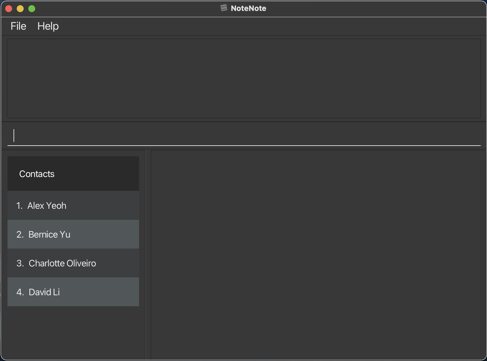
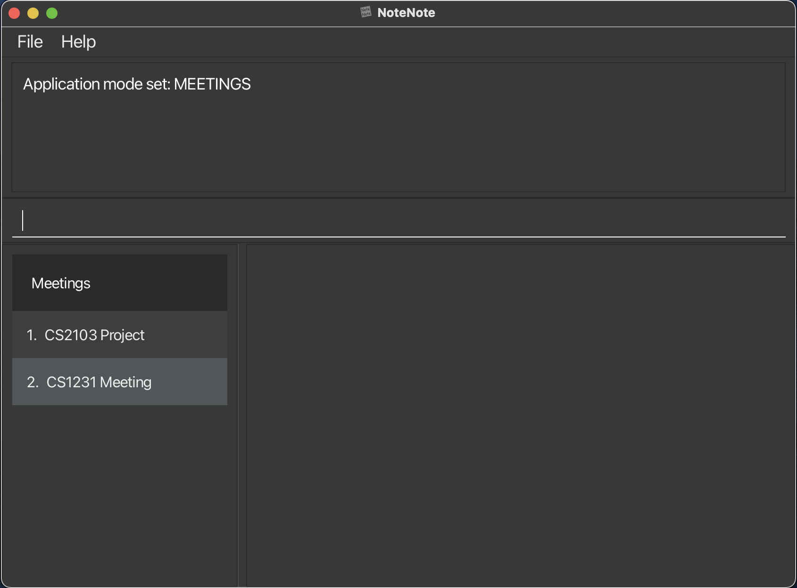
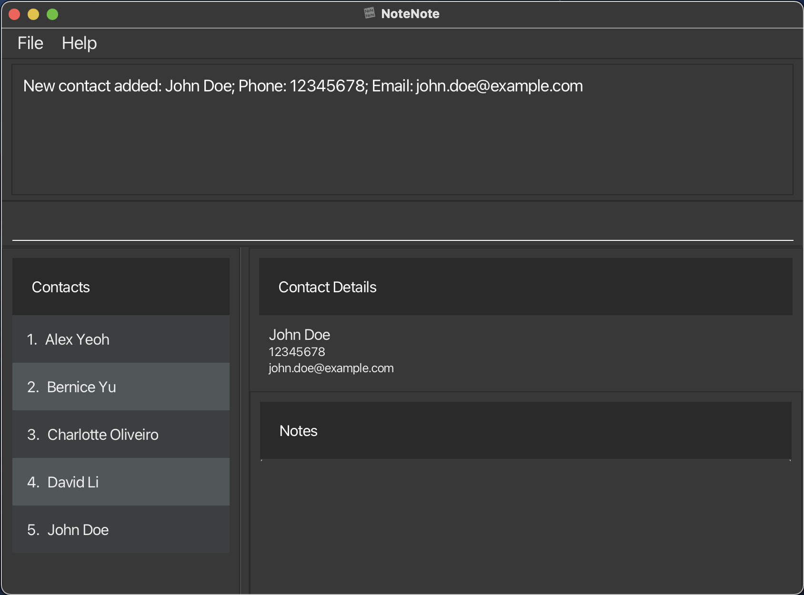
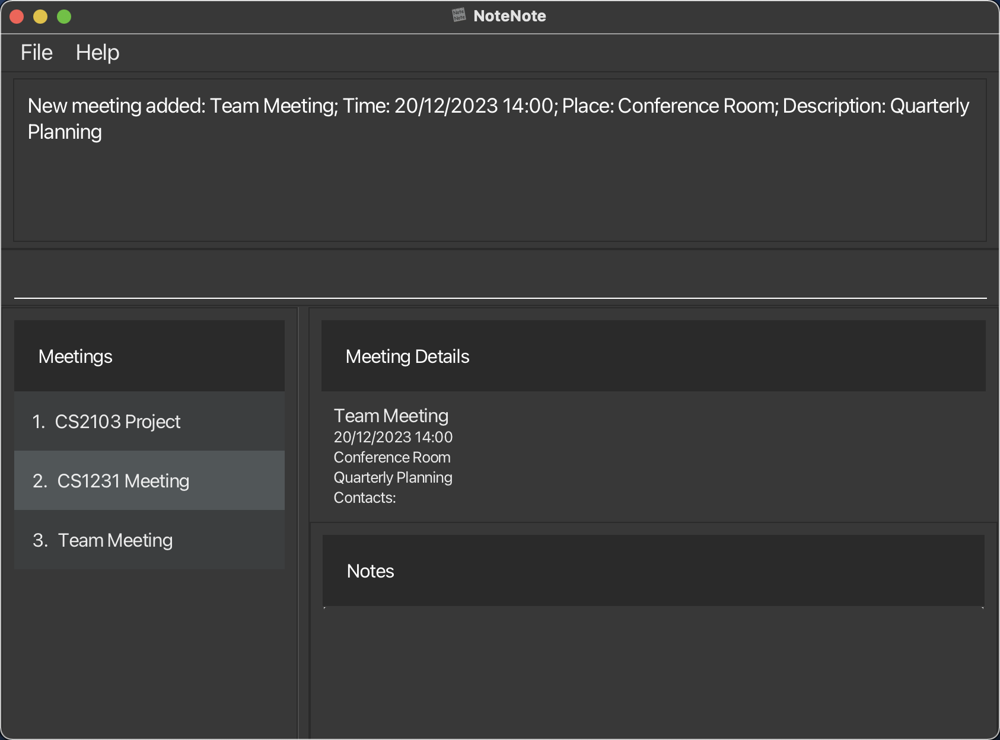
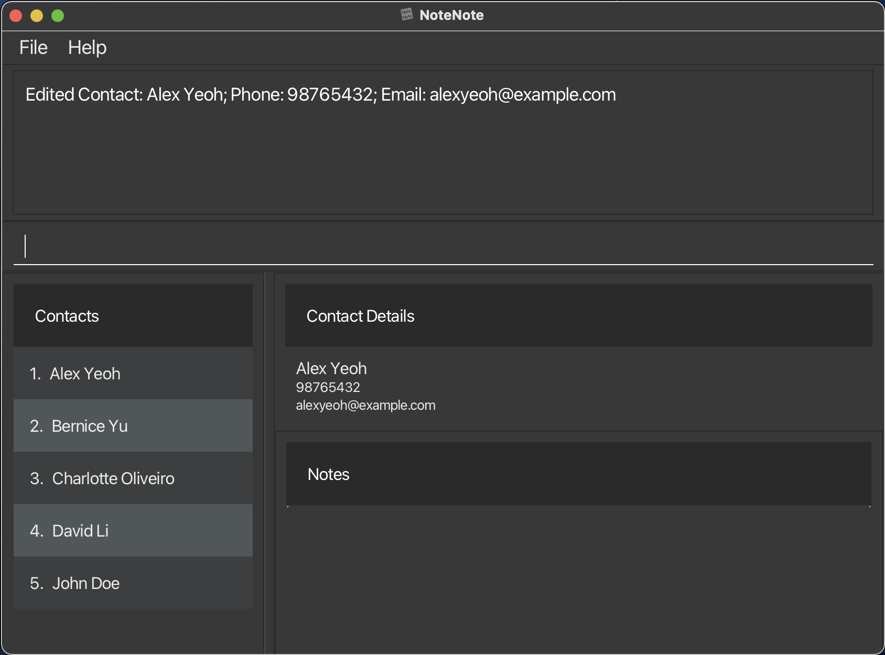
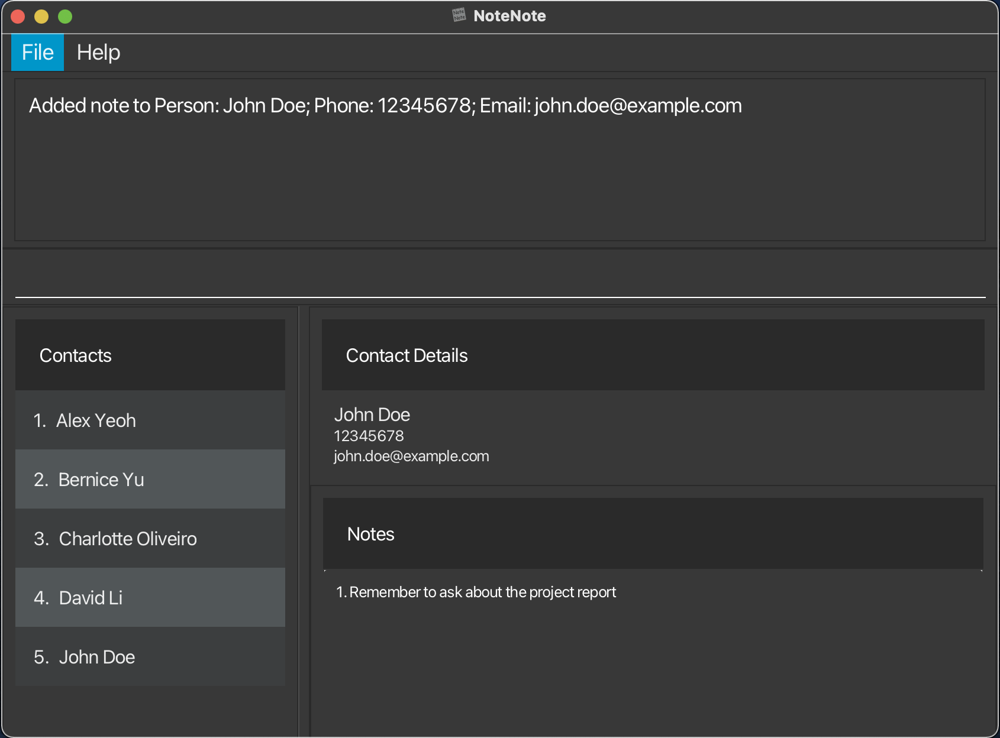
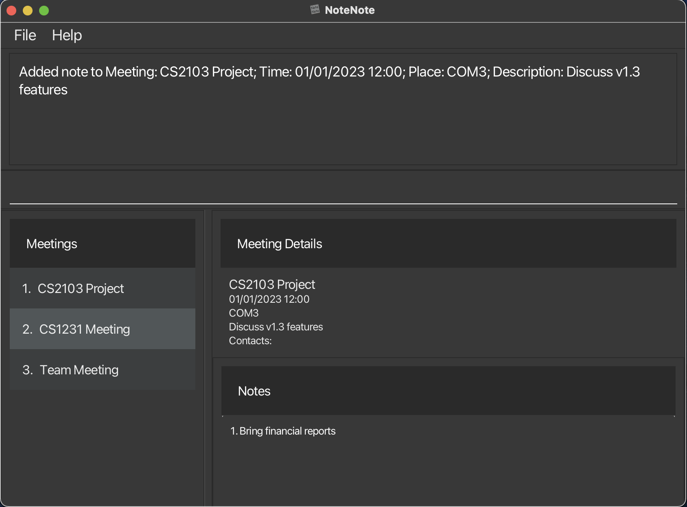
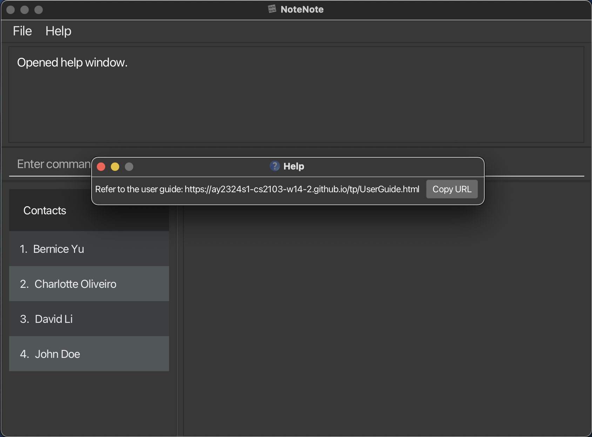

NoteNote is a desktop application designed for swift and systematic management of contact information and meeting details. It's tailored specifically for proficient typists
and users who prefer the speed and flexibility of a Command Line Interface (CLI).

With NoteNote, you can swiftly record notes, organize contacts, and schedule meetings—all through quick keyboard commands. The application streamlines the process of categorizing and retrieving contact and meeting information, making it an essential tool for anyone looking to optimize their note-taking and data management tasks through a powerful CLI.

In this User Guide, you'll find a detailed walkthrough of all the features that NoteNote offers. It's here to assist you in harnessing the full potential of the application, ensuring that your data management is as streamlined and effective as your typing.

## Table of Contents

1. [Quick Start](#quick-start)
2. [Tutorials for New Users](#tutorial-for-new-users)
3. [Features](#features)
    - [`mode` Switch Mode](#mode)
    - [Contact Management](#contact-management)
        - [`add` Create New Contact](#create-new-contact)
        - [`view` View a Contact](#view-a-contact)
        - [`list` List All Contacts](#list-all-contacts)
        - [`edit` Edit a Contact](#editing-a-contact)
        - [`delete` Delete a Contact](#delete-a-contact)
    - [Meeting Management](#meeting-management)
        - [`add` Create a New Meeting](#create-a-new-meeting)
        - [`view` View a Meeting](#view-a-meeting)
        - [`list` List All Meetings](#list-all-meetings)
        - [`delete` Delete a Meeting](#delete-a-meeting)
        - [`edit` Edit a Meeting](#edit-a-meeting)
        - [`addcontact` Add Contact to Meeting](#add-contact-to-meeting)
        - [`deletecontact` Delete Contact from Meeting](#delete-contact-from-meeting)
    - [Note-Taking](#note-taking)
        - [`addnote` Add Notes to a Contact or Meeting](#add-notes-to-a-contact-or-meeting)
        - [`deletenote` Delete Notes from a Contact or Meeting](#delete-notes-from-a-contact-or-meeting)
    - [Miscellaneous](#miscellaneous)
        - [`↑`/`↓` Command History](#command-history)
        - [`help` Open User Guide](#get-help-from-user-guide)
        - [`clear` Clear AddressBook](#clear-addressbook)
        - [`exit` Exit Command](#exit-command)
        - [Auto-Save Functionality](#auto-save-functionality)
4. [Command Summary](#command-summary)
5. [Acceptable Parameters](#acceptable-parameters)
6. [FAQ](#frequently-asked-questions)
7. [Known Issues](#known-issues)
8. [Glossary](#glossary)

---

## Quick Start

1. **Installation:**
    - Ensure you have Java `11` or above installed on your Windows, Mac, or Linux machine.
    - Download the latest version of `NoteNote.jar` from our [github repository](https://github.com/AY2324S1-CS2103-W14-2/tp). It should be under the *Releases*.
    - Extract the package to a folder of your choice and double-click on `NoteNote.jar` to start the app.
    - If the app cannot open because it is from an unknown publisher:
        - Open your terminal and `cd` into the folder the jar is in.
        - Use the `java -jar NoteNote.jar` command to run the application.

2. **Using the application:**
    - When you start `NoteNote` for the first time, a default contact and meeting list will be created for you.
    - The app will be set into `Contact` mode by default and you will see the following window:

   

    - All commands are executed by typing them into the command box and pressing *Enter*.
    - To exit the application, either close the window, or type `exit` and press *Enter*.

3. **Saving the Data:**
    - `NoteNote` automatically saves your data after each command that changes the data.
    - There is no need to save manually; all your contacts, meetings, and notes are stored locally on your machine.

4. **Getting Help:**
    - If you require assistance, use the `help` command to open a pop-up window leading you to this User Guide. You can do this by typing it, clicking on the *Help* button in the navigation bar, or pressing *F1*.

Begin by exploring these basic commands, and don't hesitate to consult the detailed sections of this guide for each feature. Happy note-taking!

For a more detailed guide on how to use our application effectively to take notes, please refer to our [tutorial for new users](#tutorial-for-new-users).

[Back to Top](#table-of-contents)

---

## Tutorial for New Users

Welcome to NoteNote! This step-by-step tutorial will guide you through the basics of using our application to manage your contacts and meetings efficiently. Let's get started:

1. **Launching the Application**

- After installing NoteNote, locate the NoteNote.jar file in the folder you extracted it to.
- Double-click on the file to open the application. You should see the main window with a user interface ready for your commands.

2. **Exploring Modes**

- By default, NoteNote starts in `contacts` mode.
- Type `mode` into the command box at the bottom of the window and hit *Enter*. This will switch you to `meetings` mode. Typing `mode` again will switch you back.



3. **Adding Your First Contact**

- Ensure you're in contacts mode.
- To add a contact, type `add n/John Doe p/12345678 e/john.doe@example.com` into the command box and press *Enter*.
- You'll see the new contact added to the list and a confirmation message in the result display box.



4. **Creating a Meeting**

- Switch to meetings mode by typing `mode`.
- Add a meeting with the command `add m/Team Meeting t/20/12/2023 14:00 p/Conference Room d/Quarterly Planning`.
- The new meeting will appear in your meetings list with the specified details.



5. **Viewing and Editing Details**

- To view the details of the first contact, make sure you're in contacts mode and type `view 1`.
- To change the phone number of that contact, type `edit 1 p/98765432`.



6. **Taking Notes**

- Add a note to John Doe by typing `addnote id/5 note/Remember to ask about the project report`, assuming John Doe has an id of 5.
- To add a note to your meeting, switch to meetings mode and type `addnote id/1 note/Bring financial reports`.



7. **Deleting Entries**

- If you made a mistake or need to remove a contact, simply type `delete 1` while in the contacts mode.
- Similarly, to delete a meeting, switch to meetings mode and enter `delete 1`.



8. **Getting Help**

- At any point, if you need help, type in the `help` command, or press *F1*.
- This will open a pop-up window that will lead you to this user guide.



This concludes the basic tutorial for NoteNote. With these steps, you should be equipped to start organizing your contacts and meetings effectively. For further assistance, use the `help` command.

Thank you for using NoteNote. Happy organizing!

[Back to Top](#table-of-contents)

---

## Features

### Mode

- **What it does**: Toggles the mode of the application between `contacts` and `meetings`. The application defaults to the "contacts" mode. The mode of the application determines the context in which the following commands are executed upon for example performing an `add` command in `contacts` mode will add a contact while using an `add` command in `meetings` mode will add a meeting. The following commands are affected by the mode of the application:
    1. `add`
    2. `view`
    3. `edit`
    4. `delete`
    5. `addnote`
    6. `deletenote`
    7. `list`


- **Command Format**: `mode`

- **Expected Outputs**:
    - “Application mode set: [CURRENT_MODE].”

[Back to Top](#table-of-contents)

---

## Contact Management:

### Create New Contact

- **What it does**: Adds a new contact to the list when in the `contacts` mode. Users are considered the same if they have the same name (case-sensitive).

- **Command Format**: `add n/CONTACT_NAME p/PHONE_NUMBER e/EMAIL_ADDRESS`

- **Example**: `add n/Sarah Woo p/82775346 e/sarah.woo@gmail.com`

- **Acceptable Values**:
    - CONTACT_NAME: String, alphanumeric values and at least 2 characters long. Case-sensitive.
    - PHONE_NUMBER: Integers, at least 3 digits long.
    - EMAIL_ADDRESS: String, any valid email address.

- **Expected Outputs**:
    - Success: "New contact added [CONTACT_NAME]; Phone:[PHONE_NUMBER]; Email:[EMAIL_ADDRESS]"
    - Failure:
        - If the CONTACT_NAME already exists: `This contact already exists in the address book`
        - If invalid command format: `Invalid command format!
          add: Adds a contact to the address book. Parameters: n/ NAME p/ PHONE e/ EMAIL Example: add n/ John Doe p/ 98765432 e/ johnd@example.com`
        - If multiple values specified for a parameter: `Multiple values specified for the following single-valued field(s): [Parameters]`
        - If unacceptable parameter values: Appropriate error message returned.

### View a Contact

- **What it does**: Displays details of a specific contact when in the `contacts` mode.

- **Command Format**: `view CONTACT_ID`

- **Example**: `view 1`

- **Acceptable Values**:
    - CONTACT_ID: Positive integer. Must be a value that exists in the contact list.

- **Expected Outputs**:
    - Success: "Showing Contact Note: [CONTACT_NAME];Phone:[PHONE_NUMBER];Email:[EMAIL_ADDRESS]"
    - Failure:
        - If the positive CONTACT_ID does not exist: `The contact index provided is invalid`
        - If invalid command format: `Invalid command format!
          view: Shows the details of the contact identified by its id in the displayed contact list. Parameters: CONTACT_ID (must be a positive integer)
          Example: view 1`

### List All Contacts

- **What it does**: Shows all contacts in the list when in the `contacts` mode. All fields after list are optional arguments. If no valid parameter provided, list all contacts.

- **Command Format**: `list [n/NAME] [p/PHONE] [e/EMAIL] [note/NOTE]`

- **List Filter**: Only show contacts that satisfy the given filter. Multiple fields can be specified at the same time and all the fields are optional arguments.
    - Name filter `[m/Name]`: show the contacts which name matches the input keyword
        - The order of the keywords does not matter. e.g. Hans Bo will match Bo Hans
        - Keywords can be a partial word eg.`mee...`
        - Keywords are not case-sensitive
        - Contacts matching at least one keyword will be returned (i.e. space separated OR search). e.g. Engine Canteen will return Science Canteen, Engine Lounge

    - Phone filter `[p/PHONE]`: show the contact which phone number matches the input keyword
        - Keywords can be the partial phone number eg.`963...`
        - Keywords are not case-sensitive

    - Email filter `[d/EMAIL]`: show the contact which Email matches the input keyword
        - Keywords can be the partial phone number eg.`963...`
        - Keywords are not case-sensitive

    - Notes filter `[note/NOTE]`" show the contact which notes matches the input keyword
        - The order of the keywords does not matter. e.g. Hans Bo will match Bo Hans
        - Keywords can be a partial word eg.`mee...`
        - Keywords are not case-sensitive
        - Contacts matching at least one keyword will be returned (i.e. space separated OR search). e.g. Engine Canteen will return Science Canteen, Engine Lounge

    - **Important**: If there is a mix of valid and invalid inputs, the app will honour the valid inputs and ignore the invalid inpiuts, for a better user experience eg. `list n/Jack w/invalid inputs` - list will show contacts with names containing `jack` and ignore `w/invalid inputs`

- **Expected Outputs**:
    - Success: `Listed all contacts.`
    - Order of List: Lexicographical Order

### Editing A Contact

- **What it does**: Edits an existing person in the address book when in the `contacts` mode.

- **Command Format**: `edit CONTACT_ID [n/CONTACT_NAME] [p/PHONE_NUMBER] [e/EMAIL_ADDRESS]`

- **Example**: `edit 3 p/90649923`

- **Acceptable Values**:
    - CONTACT_ID: Positive integer. Must be a value that exists in the contact list. Must be the first parameter in the command.
    - CONTACT_NAME: String, alphanumeric values and at least 2 characters long. Case-sensitive.
    - PHONE_NUMBER: Integers, at least 3 digits long.
    - EMAIL_ADDRESS: String, any valid email address.

- **Expected Outputs**:
    - Success: "Edited Contact: [CONTACT_NAME];Phone:[PHONE_NUMBER]"
    - Failure:
        - If no field to edit is specified: `At least one field to edit must be provided.`
        - If the CONTACT_ID does not exist: `The contact index provided is invalid`
        - If multiple values specified for a parameter: `Multiple values specified for the following single-valued field(s): [Parameters]`
        - If unacceptable parameter values: Appropriate error message returned.

### Delete a Contact

- **What it does**: Removes a contact based on the given ID when in the `contacts` mode.

- **Command Format**: `delete CONTACT_ID`

- **Example**: `delete 3`

- **Acceptable Values**:
    - CONTACT_ID: Positive integer. Must be a value that exists in the contact list.

- **Expected Outputs**:
    - Success: "Deleted Contact: [CONTACT_NAME];Phone:[PHONE_NUMBER];Email:[EMAIL_ADDRESS]"
    - Failure:
        - If the CONTACT_ID does not exist: `The contact index provided is invalid`
        - If the command is invalid: `Invalid command format!
          delete: Deletes the contact identified by the index number used in the displayed contact list. Parameters: INDEX (must be a positive integer)
          Example: delete 1`

[Back to Top](#table-of-contents)

---

## Meeting Management:

### Create a New Meeting

- **What it does**: Creates a new meeting when in the `meetings` mode.

- **Command Format**: `add m/MEETING_NAME t/TIME p/LOCATION d/DESCRIPTION`

- **Example**: `add m/ Project Discussion t/ 03/10/2023 15:00 p/ Terrace d/ Discussing milestone`

- **Acceptable Values**:
    - MEETING_NAME: String, alphanumeric values and at least 1 character long.
    - TIME: Follow the `DD/MM/YYYY HH:MM` format
    - LOCATION: String, alphanumeric values and at least 1 character long.
    - DESCRIPTION: String, any value.

- **Expected Outputs**:
    - Success: "New meeting added: [MEETING_NAME];Time:[TIME];Place:[LOCATION];Description:[DESCRIPTION]"
    - Failure:
        - If the MEETING_NAME already exists: `Meeting already exists.`
        - If invalid command format: `Invalid command format!
          add: Adds a meeting to the address book. Parameters: m/ TITLE t/ TIME p/ PLACE d/ DESCRIPTION Example: add m/ Project Discussion t/ 03/10/2023 15:00 p/ Terrace d/ Discussing milestones`
        - If multiple values specified for a parameter: `Multiple values specified for the following single-valued field(s): [Parameters]`
        - If unacceptable parameter values: Appropriate error message returned.

### View a Meeting

- **What it does**: Displays details of a specific meeting when in the `meetings` mode.

- **Command Format**: `view MEETING_ID`

- **Example**: `view 1`

- **Acceptable Values**:
    - MEETING_ID: Positive integer. Must be a value that exists in the meeting list.

- **Expected Outputs**:
    - Success: "Showing Meeting: [MEETING_NAME];Time:[TIME];Place:[LOCATION];Description:[DESCRIPTION]"
    - Failure:
        - If the MEETING_ID does not exist: `The meeting index provided is invalid`
        - If the command is invalid: `Invalid command format!
          view: Shows the details of the meeting identified by its id in the displayed meeting list. Parameters: INDEX (must be a positive integer)
          Example: view 1`

### List All Meetings

- **What it does**: Shows a list of all meetings when in the `meetings` mode. All arguments after `list` are optional arguments. Other commands which use index will be affected by the updated indexes shown on the GUI. If no valid parameter provided, list all meetings.

- **Command Format**: `list [m/TITLE] [ts/TIME START] [te/TIME END] [p/PLACE] [d/DESCRIPTION] [note/NOTE]`

- **List Filter**: Only show meetings that satisfy the given filter. Multiple fields can be specified at the same time and all the fields are optional arguments.
    - title filter `[m/Title]`: show the meetings which title matches the input keyword
        - Behavior see details

    - time filter `[ts/TIME START]` `[te/TIME END]`: show the meetings that occurs in between `TIME START` and `TIME END`
        - time should be in the format DD/MM/YYYY HH:MM
        - the results are inclusive of the input time
        - If only `[ts/TIME START]` is provided, then all the meeting from the start time are shown
        - If only `[te/TIME END]` is provided, then all the meeting up until the end time are shown

    - place filter `[p/PLACE]`: show the meeting which place matches the input keyword
        - Behavior see details

    - description filter `[d/DESCRIPTION]`: show the meeting which description matches the input keyword
        - Behavior see details

    - notes filter `[note/NOTE]`" show the meeting which notes matches the input keyword

    ```
    - Details
        * The order of the keywords does not matter. e.g. Hans Bo will match Bo Hans
        * Keywords can be a partial word eg.`mee...`
        * Keywords are not case-sensitive
        * Meetings matching at least one keyword will be returned (i.e. space separated OR search). e.g. Engine Canteen will return Science Canteen, Engine Lounge
    ```

    - **Important**: If there is a mix of valid and invalid inputs, the app will honour the valid inputs and ignore the invalid inputs, for a better user experience eg. `list p/engin w/invalid inputs` - list will show meetings with places containing `engine` and ignore `w/invalid inputs`


- **Expected Outputs**:
    - Success: `%d meetings Listed!`
    - Order of List: Chronological Order of Meeting Time

### Delete a Meeting

- **What it does**: Cancels a meeting based on the given ID when in the "meetings" mode.

- **Command Format**: `delete MEETING_ID`

- **Example**: `delete 1`

- **Acceptable Values**:
    - MEETING_ID: Positive integer. Must be a value that exists in the meeting list.
- **Expected Outputs**:
    - Success: "Successfully deleted [MEETING_NAME]."
    - Failure:
        - If the MEETING_ID does not exist: `The meeting index provided is invalid`
        - If the MEETING_ID is not provided OR If invalid command format: `Invalid command format`

### Edit A Meeting

- **What it does** Edits the details of an existing meeting in the address book when in the `meetings` mode.

- **Command Format**: `edit MEETING_ID [m/MEETING_NAME] [t/TIME] [p/LOCATION] [d/DESCRIPTION]`

- **Example**: `edit 1 p/COM3`

- **Acceptable Values**:
    - MEETING_ID: Positive integer. Must be a value that exists in the meeting list. Must be the first parameter in the command.
    - MEETING_NAME: String, alphanumeric values and at least 1 character long.
    - TIME: Follow the `DD/MM/YYYY HH:MM` format
    - LOCATION: String, alphanumeric values and at least 1 character long.
    - DESCRIPTION: String, any value.

- **Expected Outputs**:
    - Success: "Edited Meeting [MEETING_NAME];Time:[TIME];Place:[LOCATION];Description:[DESCRIPTION]"
    - Failure:
        - If the MEETING_ID does not exist: `The meeting index provided is invalid`
        - If invalid command format: `Invalid command format!
          edit: Edits the details of the meeting identified by the index number used in the displayed meeting list. Existing values will be overwritten by the input values. Parameters: INDEX (must be a positive integer) [m/ TITLE] [t/ TIME] [p/ PLACE] [d/ DESCRIPTION]... Example: edit 1 p/ Zoom d/ Discuss Project Details`
        - If no parameters provided: `At least one field to edit must be provided.`
        - If multiple values specified for a parameter: `Multiple values specified for the following single-valued field(s): [Parameters]`
        - If unacceptable parameter values: Appropriate error message returned.

### Add Contact to Meeting

- **What it does**: Adds a contact to an existing meeting as a participant when in the `meetings` mode. No duplicate meetings are allowed and meetings are considered to be the same if they have the same name.

- **Command Format**: `addcontact n/CONTACT_NAME m/MEETING_NAME`

- **Example**: `addcontact n/Sarah Woo m/Project Discussion`

- **Acceptable Values**:
    - MEETING_NAME: String, must exist in meeting list. Case-sensitive.
    - CONTACT_NAME: String, must exist in contact list. Case-sensitive.

- **Expected Outputs**:
    - Success: "Added contact '[CONTACT_NAME]' to Meeting '[MEETING_NAME]'."
    - Failure:
        - If the MEETING_NAME does not exist: `The meeting specified is not created`
        - If the CONTACT_NAME does not exist: `The person specified is not created`
        - If the CONTACT_NAME is already in this meeting: `This contact already exists in the meeting`
        - If invalid command format: `Invalid command format!
          addcontact: Adds the participants to the meeting identified by the name of the contact. Parameters: n/
          [CONTACT NAME] m/ [MEETING NAME]
          Example: addcontact n/ Sarah Woo m/ Project Discussion`

### Delete Contact from Meeting

- **What it does**: Removes a contact from an existing meeting when in the `meetings` mode.

- **Command Format**: `deletecontact n/CONTACT_NAME m/MEETING_NAME`

- **Example**: `deletecontact n/Sarah Woo m/Project Discussion`

- **Acceptable Values**:
    - MEETING_NAME: String, at least 2 characters long. Case sensitive.
    - CONTACT_NAME: String, at least 2 characters long. Case sensitive.

- **Expected Outputs**:
    - Success: "Removed contact '[CONTACT_NAME]' from Meeting '[MEETING_NAME]'."
    - Failure:
        - If the MEETING_NAME does not exist: `The meeting specified is not created`
        - If the CONTACT_NAME does not exist or isn't a part of the specified meeting: `The person specified is not created`
        - If invalid command format: `Invalid command format!
          deletecontact: Removes the participants to the meeting identified by the name of the contact. Parameters: n/
          [CONTACT NAME] m/ [MEETING NAME]
          Example: deletecontact n/ Sarah Woo m/ Project Discussion`

[Back to Top](#table-of-contents)

---

## Note-Taking:

### Add Notes to a Contact or Meeting

- **What it does**: Associates notes with a specific contact or meeting

- **Command Format**:
    - For Contacts when in "Contacts" mode: `addnote id/CONTACT_ID note/NOTES`
    - For Meetings when in "Meetings" mode: `addnote id/MEETING_ID note/NOTES`

- **Examples**:
    - `addnote id/5 note/Has a dog named Benny`
    - `addnote id/1 note/Agenda: Discuss Q2 results`

- **Acceptable Values**:
    - CONTACT_ID: Non-negative integer within range of Contact indexes.
    - MEETING_ID: Non-negative integer within range of Meeting indexes.
    - NOTES: String, at least 1 character long.

- **Expected Outputs**:
    - Success:
        - "Successfully added note to Contact: [Details of CONTACT]."
        - "Successfully added note to Meeting: [Details of MEETING]."
    - Failure:
        - If the CONTACT_ID or CONTACT_NAME does not exist: `The contact index provided is invalid`
        - If the MEETING_ID or MEETING_NAME does not exist: `The meeting index provided is invalid`
        - If the NOTES already exists for a given contact/meeting: `Error: the note already exists.`
        - If the NOTES aren't provided OR If invalid command format: `Invalid command format!
          addnote: Add notes to contact Parameters: id/CONTACT_ID_or_CONTACT_NAME note/NOTES Example: addnote id/5 note/ Has a dog named Benny`

### Delete Notes from a Contact or Meeting

- **What it does**: Removes specified notes from a contact or meeting.

- **Command Format**:
    - For Contacts when in "Contacts" mode: `deletenote id/CONTACT_ID noteid/NOTE_ID`
    - For Meetings when in "Meetings" mode: `deletenote id/MEETING_ID noteid/NOTE_ID`

- **Examples**:
    - `deletenote id/5 noteid/2`

- **Acceptable Values**:
    - CONTACT_ID: Non-negative integer within range of Contact indexes.
    - MEETING_ID: Non-negative integer within range of Meeting indexes.
    - NOTE_ID: Non-negative integer within range of noteIDs. ID of the note as displayed in the notes list of a contact or meeting.

- **Expected Outputs**:
    - Success:
        - "Removed note from Contact: [Details of CONTACT]."
        - "Removed note from Meeting: [Details of MEETING]."
    - Failure:
        - If the CONTACT_ID does not exist: `The contact index provided is invalid`
        - If the MEETING_ID does not exist: `The meeting index provided is invalid`
        - If no note exists for the specified note index in the contact or meeting: `Failed to remove note from Meeting: {Meeting Details}`
        - If invalid command format: `Invalid command format!
          deletenote: Remove notes from contact Parameters: id/CONTACT_ID_or_CONTACT_NAME index/INDEX Example: deletenote id/5 noteid/1`

[Back to Top](#table-of-contents)

---

## Miscellaneous:

### Command History

- **What it does**: Allows you to navigate through your most recent commands using the keyboard.

- **How to use**: Use the up (`↑`) and down (`↓`) arrow keys in the command box to cycle through your command history.

- **Note**: You can type in the input, then use the arrow keys to autocomplete and navigate through input you have already entered in your command history.

### Get Help from User Guide

- **What it does**: Opens a pop-up window with a link to this user guide.

- **Command Format**: `help`

- **Expected Outputs**:
    - Success: `Opened help window.` Displays a pop-up window with a link to the user guide.

### Clear AddressBook

- **What it does**: Clears all contacts and meetings from memory in the entire address book.

- **Command Format**: `clear`

- **Expected Outputs**:
    - Success: `Address book has been cleared!`

### Exit Command

- **What it does**: Close the application window.

- **Command Format**: `exit`

- **Expected Outputs**:
    - Success: The window is closed and the program stops running.

### Auto-Save Functionality

- **What it does**: Automatically saves your data after each command that alters the data.

- **Note**: There is no need for manual save commands; all changes are instantly and safely stored on your device.

[Back to Top](#table-of-contents)

---

## Command Summary

Below is a summary table of the commands for NoteNote, with example inputs:

| Command | Format, Example |
|---------|---------------------|
| Mode | `mode` |
| Add Contact | `add n/CONTACT_NAME p/PHONE_NUMBER e/EMAIL_ADDRESS`, e.g. `add n/Alice p/12345678 e/alice@example.com` |
| Add Meeting | `add m/MEETING_NAME t/TIME p/LOCATION d/DESCRIPTION`, e.g. `add m/Project Kickoff t/25/12/2023 09:00 p/Main Office d/Initial project briefing` |
| View Contact/Meeting | `view INDEX`, e.g. `view 1` |
| Edit Contact | `edit CONTACT_ID [n/CONTACT_NAME] [p/PHONE_NUMBER] [e/EMAIL_ADDRESS]`, e.g. `edit 2 p/98765432 e/bob@example.com` |
| Edit Meeting | `edit MEETING_ID [m/MEETING_NAME] [t/TIME] [p/LOCATION] [d/DESCRIPTION]`, e.g. `edit 1 t/26/12/2023 10:00` |
| Delete Contact/Meeting | `delete INDEX`, e.g. `delete 3` |
| Add Note to Contact/Meeting | `addnote id/ID note/NOTE`, e.g. `addnote id/4 note/Bring quarterly reports` |
| Delete Note from Contact/Meeting | `deletenote id/ID noteid/NOTE_ID`, e.g. `deletenote id/4 noteid/2` |
| Add Contact to Meeting | `addcontact n/CONTACT_NAME m/MEETING_NAME`, e.g. `addcontact n/Alex Yeoh m/CS2103 Meeting` |
| Delete Contact from Meeting | `deletecontact n/CONTACT_NAME m/MEETING_NAME`, e.g. `deletecontact n/Bernice Yu m/CS2101 Meeting` |
| List Contacts/Meetings | `list` |
| Help | `help` |
| Clear | `clear` |
| Exit | `exit` |

For a detailed explanation of each command, please refer to the detailed [sections](#features) of this guide.

[Back to Top](#table-of-contents)

---

## Acceptable Parameters

The following table outlines the acceptable input values for various parameters used across commands in NoteNote:

| Parameter | Acceptable Values | Description |
|-----------|-------------------|-------------|
| `CONTACT_NAME` | Alphanumeric, at least 2 characters | The name of a contact, case-sensitive. |
| `PHONE_NUMBER` | Numeric, at least 3 digits | A valid phone number without spaces or symbols. |
| `EMAIL_ADDRESS` | Valid email format | Must contain an `@` symbol and domain. |
| `MEETING_NAME` | Alphanumeric, at least 1 character | The title or name of a meeting. |
| `TIME` | `DD/MM/YYYY HH:MM` format | Date and time for meetings. |
| `LOCATION` | Alphanumeric, at least 1 character | The place where the meeting is held. |
| `DESCRIPTION` | Any text | Additional details about a contact or meeting. |
| `CONTACT_ID` | Positive integer | The unique identifier for a contact, must be within range of Contact indexes. |
| `MEETING_ID` | Positive integer | The unique identifier for a meeting, must be within range of Meeting indexes. |
| `NOTE_ID` | Positive integer | The unique identifier for a note within a contact or meeting, must be within range of note indexes within that contact or meeting. |
| `NOTES` | Any text, at least 1 character | Note content to be associated with a contact or meeting. |
| `INDEX` | Positive integer | Used in commands that refer to the list index of contacts or meetings, must be within range of Contact or Meeting indexes. |

Please ensure to follow the acceptable input formats when entering commands to avoid errors. This table is a simplified guide; refer to the detailed command instructions for more information on how to use these parameters within specific commands.

[Back to Top](#table-of-contents)

---

## Frequently Asked Questions

**Q**: How do I transfer my data to another Computer?

**A**: Install the app in the other computer and overwrite the empty data file it creates with the file that contains the data of your previous NoteNote home folder.

**Q**: What should I do if I find a bug or want to suggest a new feature?

**A**: If you encounter any bugs or would like to suggest improvements, please head over to our [GitHub repository](https://github.com/AY2324S1-CS2103-W14-2/tp) and open a new issue. Your contributions are greatly appreciated and help make NoteNote better for everyone.

[Back to Top](#table-of-contents)

---

## Known Issues

- Newly added contacts/meetings are not automatically selected without scrolling down when there are several contacts/meetings already existing. However when adding a new contact the result box is updated for visual feedback.
- Some users reported that the scrollbar of the contact/meeting list disappears when the screen size is too small.
- Lists are sorted alphabetically instead of order they were added in. This is intended, and will likely be optimised in the future by adding a sort command (allowing the user to decide alphabetically or chronologically).
- The commands for contacts and meetings do not use the `id/` prefix, whereas the notes and adding of contacts to meetings commands do. We plan on standardising this in the future for user comfort.

[Back to Top](#table-of-contents)

---

## Glossary

| Term                               | Definition                                                                                                                                           |
| ---------------------------------- | ---------------------------------------------------------------------------------------------------------------------------------------------------- |
| **Command Line Interface (CLI)**| A text-based interface used for entering commands directly. In NoteNote, the command box where you type commands is a form of CLI. |
| **Compulsory Arguments**   | arguments in square brackets are optional arguments eg. `list [n/NAME] [p/PHONE] [e/EMAIL] [note/NOTE]` |
| **Optional Arguments** | Arguments not in square brackets are compulsory arguments eg. `add n/Sarah Woo p/82775346 e/sarah.woo@gmail.com` |

[Back to Top](#table-of-contents)
