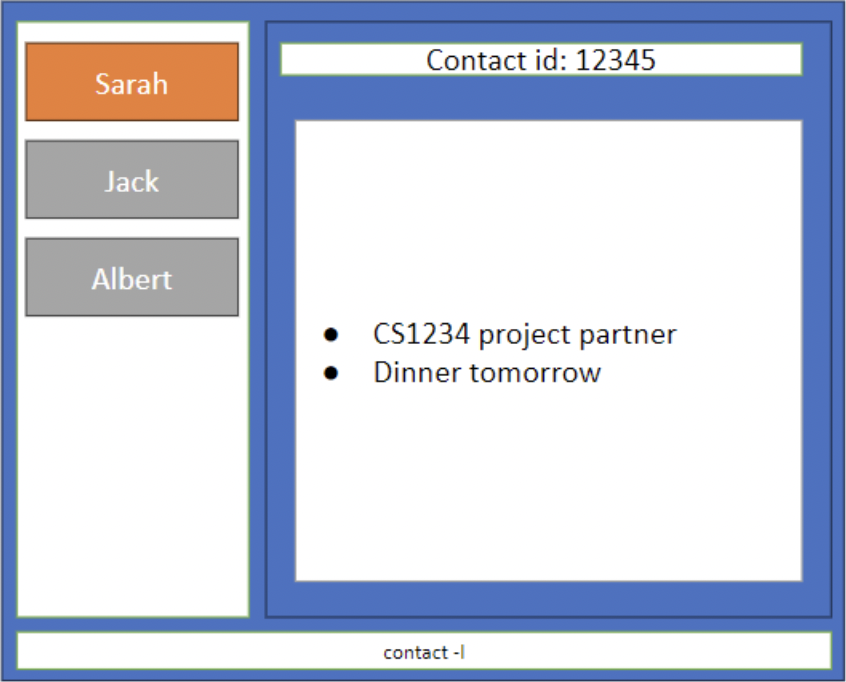

Download NoteNote [Here](https://github.com/AY2324S1-CS2103-W14-2/tp/releases/tag/v1.3(trial))!

This is a desktop meeting note-taking application that allows users to efficiently record notes for their contact.
NoteNote provide tools for organizing and categorizing contacts in a systematic and easy-to-navigate structure.
Users interact with the application through a CLI, and it has a GUI created with JavaFX.

* If you are interested in using NoteNote, head over to the [**User
  Guide**](UserGuide.md).
* If you are interested about developing NoteNote, the [**Developer Guide**](DeveloperGuide.md) is a good place to
  start.

**Acknowledgements**

* Libraries used: [JavaFX](https://openjfx.io/), [Jackson](https://github.com/FasterXML/jackson)
  , [JUnit5](https://github.com/junit-team/junit5)
